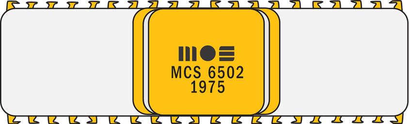
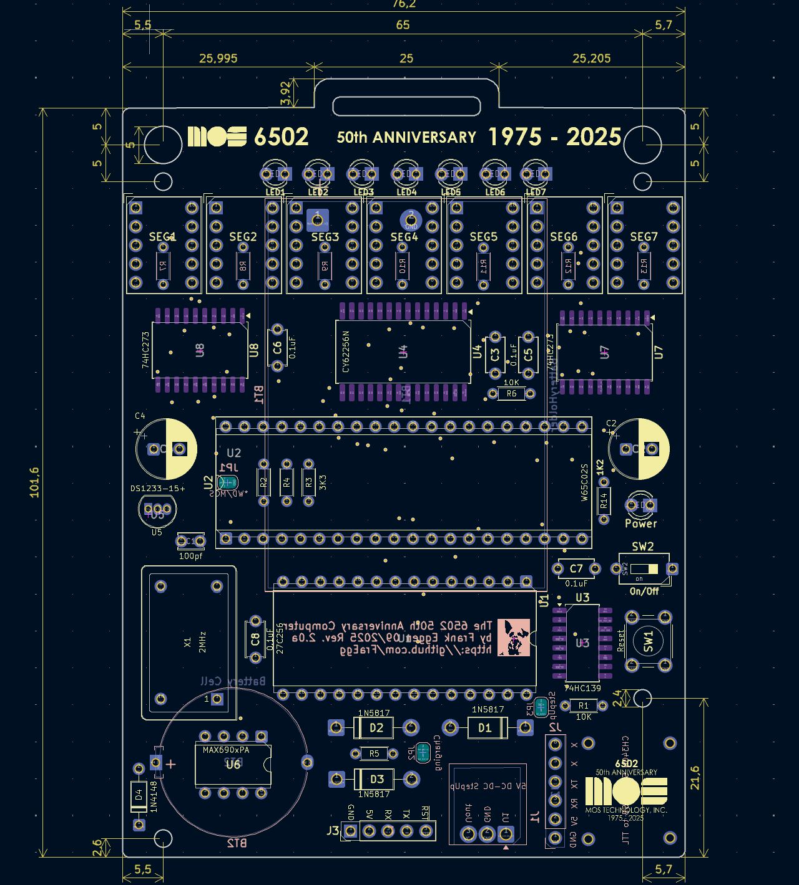
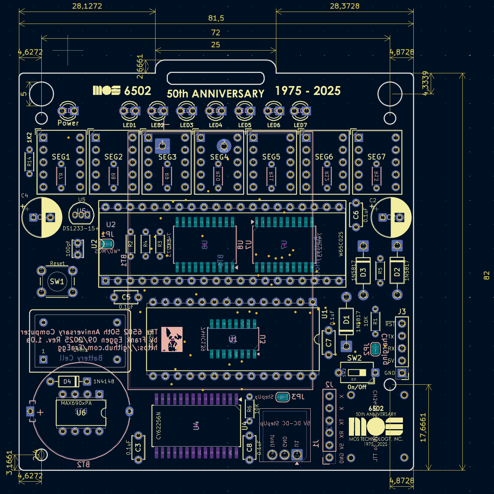
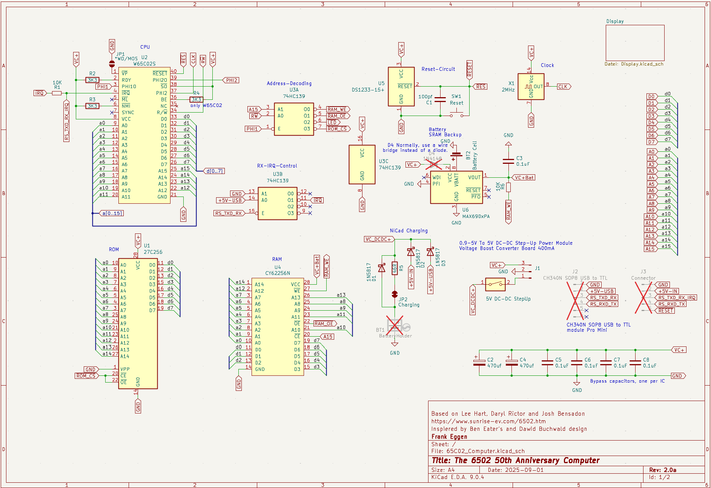
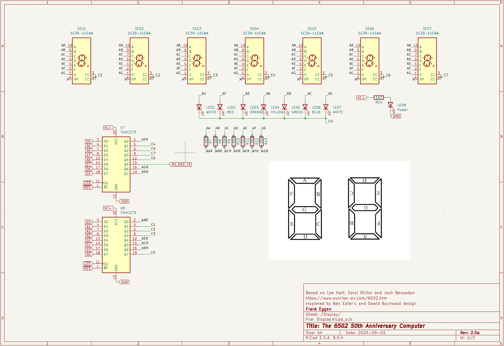
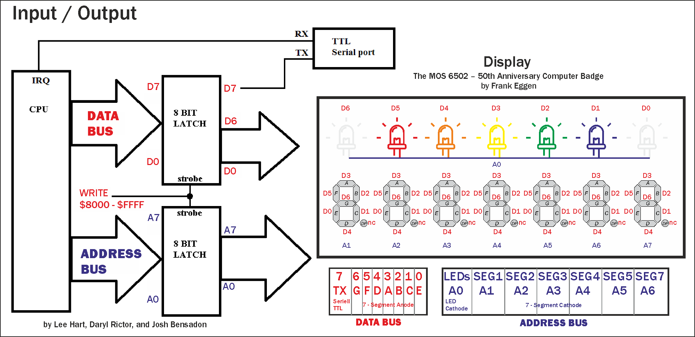
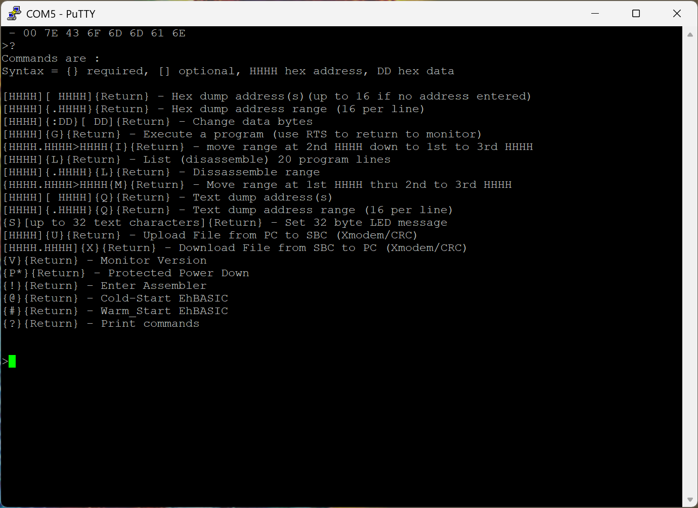

# The MOS 6502 – 50th Anniversary Computer Badge (1975–2025)

## A retro computer in a badge for 8‑bit 6502 fans

By Frank Eggen

👉 [German Version](README_DE.md)

[](https://youtu.be/MOvFbZeAMVU)

---

Based on an idea by **Lee Hart, Daryl Rictor, and Josh Bensadon** (reworked and updated).  
👉 Original project: [sunrise-ev.com/6502.htm](http://www.sunrise-ev.com/6502.htm)

---

## Table of Contents

- [50 Years of the MOS 6502 8‑bit Microprocessor](#50-years-of-the-mos-6502-8bit-microprocessor)
- [What is the Computer Badge?](#what-is-the-computer-badge)
  - [Variants](#variants)
  - [What can you use it for?](#what-can-you-use-it-for)
  - [Specs at a glance](#specs-at-a-glance)
- [Bill of Materials (BOM)](#bill-of-materials-bom)
- [Assembly](#assembly)
- [Jumper Options](#jumper-options)
- [Bring‑Up / First Power‑On](#bringup--first-poweron)
- [Schematic](#schematic)
- [Memory](#memory)
- [Input / Output](#input--output)
- [LED Display](#led-display)
- [Serial Port](#serial-port)
- [Software Overview](#software-overview)
- [6502 Badge — Monitor & Reference Manual](#6502-badge--monitor--reference-manual)
  - [Monitor Commands](#monitor-commands)
  - [Hex Dump](#hex-dump)
  - [Edit Memory](#edit-memory)
  - [Move Memory](#move-memory)
  - [Insert Memory](#insert-memory)
  - [Execute](#execute)
  - [Disassemble](#disassemble)
  - [Text Dump](#text-dump)
  - [Set LED Text](#set-led-text)
  - [Upload (XMODEM)](#upload-xmodem)
  - [Download (XMODEM)](#download-xmodem)
  - [Show Version](#show-version)
  - [Protected Power Down](#protected-power-down)
  - [Mini Assembler](#mini-assembler)
  - [Help](#help)
- [EhBASIC: Cold Start & Warm Start](#ehbasic-cold-start--warm-start)
- [EhBASIC Quick Guide & Keywords](#ehbasic-quick-guide--keywords)
- [LED Operations](#led-operations)
- [Serial I/O Routines](#serial-io-routines)
- [System Memory Usage](#system-memory-usage)
- [Source Layout & Build Notes](#source-layout--build-notes)
- [Downloads / Firmware / Manuals](#downloads--firmware--manuals)
- [Ordering](#ordering)
- [Disclaimer](#disclaimer)
- [Donations](#donations)
- [Acknowledgements](#acknowledgements)

---

## 50 Years of the MOS 6502 8‑bit Microprocessor



The legendary **MOS 6502** debuted in 1975 and changed the world of computing.  
It delivered performance at a low price and enabled the rise of **home computers**.

Well‑known 6502 systems include:

- Apple II
- Commodore VIC‑20 & C64
- Nintendo NES
- BBC Micro
- Atari VCS

👉 More history: [team6502.org](https://www.team6502.org)

---

## What is the Computer Badge?

The **MOS 6502 50th Anniversary Computer Badge** is a **minimalist re‑imagining** of the original — compatible, but easy to build with modern parts.

### Highlights

- **W65C02S microprocessor @ 2 MHz**
- **32 KiB RAM** with battery backup
- **32 KiB EPROM** with floating‑point BASIC + 6502 monitor
- **7‑digit 7‑segment LED display + 7 discrete LEDs** for effects
- **USB‑C serial TTL (CH340)** — plug straight into your PC
- **DC/DC step‑up module** for stable battery operation
- **CR2032 coin cell** to retain SRAM contents

> Fully functional, programmable in **assembly** or **BASIC** — and still small enough to wear as a retro name badge.

### Variants

**Badge Version**



- 7.62 × 10.16 cm (3 × 4 in) — classic badge format
  
  

**Small Version**



- 8.15 × 8.2 cm — more compact, technically identical
  
  

### What can you use it for?

- As a **retro name badge** with your scrolling message
- To **celebrate 50 years of the 6502 & the home‑computer era**
- As a **learning project** for assembly, BASIC, and hardware nostalgia
- For **tinkering & fun** with a minimal part count
- As a **cool collectible** for the anniversary

### Specs at a glance

- W65C02S @ 2 MHz  
- 32 KiB RAM with battery backup  
- 32 KiB EPROM (BASIC + monitor)  
- 2 × 8‑bit output latches  
- 7‑digit 7‑segment LED display + 7 LEDs  
- USB‑C‑to‑TTL CH340 UART adapter (BTE17‑06B)  
- DC/DC 5 V step‑up boost converter  
- Charging support for 3 × AA **NiCd** cells

👉 A **complete retro system** in your hand — minimalist, educational, and a real eye‑catcher at any meetup. 😎

---

## Bill of Materials (BOM)

| Pos. | Reference          | Qty | Value                  | Comment                                                                                                               | Description                                  | Datasheet                                                                                                         |
|:----:|:------------------ | ---:|:---------------------- |:--------------------------------------------------------------------------------------------------------------------- |:-------------------------------------------- |:----------------------------------------------------------------------------------------------------------------- |
| 1    | PCB                | 1   | –                      | Badge / Small version                                                                                                 | 50th Anniversary Computer Badge PCB          | –                                                                                                                 |
| 2    | BT1                | 1   | Battery holder         | –                                                                                                                     | Keystone holder for 3 × AA 1.2 V NiCd        | [Link](https://www.digikey.de/de/products/detail/keystone-electronics/106/27386)                                  |
| 3    | BT2                | 1   | Battery holder         | –                                                                                                                     | CR2032 horizontal, through‑hole              | [Link](https://www.digikey.de/de/products/detail/keystone-electronics/2464/303813)                                |
| 4    | C1                 | 1   | 100 pF                 | –                                                                                                                     | Ceramic, disc D3.4 mm, P2.50 mm (THT)        | [Link](https://www.digikey.de/en/products/detail/vishay-beyschlag-draloric-bc-components/K101K10X7RF5UH5/2356746) |
| 5    | C2, C4             | 2   | 470 µF                 | –                                                                                                                     | Electrolytic, radial D8.0 mm, P3.50 mm (THT) | [Link](https://www.digikey.de/en/products/detail/rubycon/16ZLH470MEFC8X11-5/3563382)                              |
| 6    | C3, C5, C6, C7, C8 | 5   | 100 nF                 | –                                                                                                                     | Ceramic, disc D4.7 mm, P5.00 mm (THT)        | [Link](https://www.digikey.de/en/products/detail/kemet/C322C104M5U5TA/818107)                                     |
| 7    | D1, D2, D3         | 3   | 1N5817                 | Schottky diode                                                                                                        | DO‑41 (THT)                                  | [Link](https://www.digikey.de/de/products/detail/smc-diode-solutions/1N5817/21705460)                             |
| 8    | D4                 | 1   | 1N4148                 | **Do not populate — bridge pads**                                                                                     | DO‑35 (THT)                                  | [Datasheet](https://assets.nexperia.com/documents/data-sheet/1N4148_1N4448.pdf)                                   |
| 9    | J1                 | 1   | 5 V DC/DC step‑up      | Solder via pin header                                                                                                 | Step‑up 5 V (10.5 × 11 mm)                   | [Link](https://de.aliexpress.com/item/1005005624977910.html)                                                      |
| 10   | J2                 | 1   | CH340N USB‑to‑TTL      | Solder via pin header                                                                                                 | CH340N SOP‑8 USB‑to‑TTL module               | [Link](https://de.aliexpress.com/item/1005009386863437.html)                                                      |
| 11   | J3                 | 1   | Pin header             | For tinkerers                                                                                                         | Pin header 1×05, 2.54 mm, vertical           | –                                                                                                                 |
| 12   | LED1, LED7         | 2   | LED 3.0 mm (white)     | –                                                                                                                     | LED D3.0 mm (THT)                            | [Link](https://www.digikey.de/en/products/detail/seoul-semiconductor-inc/LW520AS/2770221)                         |
| 13   | LED2               | 1   | LED 3.0 mm (red)       | –                                                                                                                     | LED D3.0 mm (THT)                            | [Link](https://www.digikey.de/en/products/detail/american-bright-optoelectronics-corporation/BL-B5134/20506048)   |
| 14   | LED3               | 1   | LED 3.0 mm (orange)    | –                                                                                                                     | LED D3.0 mm (THT)                            | [Link](https://www.digikey.de/en/products/detail/rohm-semiconductor/SLR-56DUT32/2337242)                          |
| 15   | LED4               | 1   | LED 3.0 mm (yellow)    | –                                                                                                                     | LED D3.0 mm (THT)                            | [Link](https://www.digikey.de/en/products/detail/american-bright-optoelectronics-corporation/BL-B3134/20506076)   |
| 16   | LED5               | 1   | LED 3.0 mm (green)     | –                                                                                                                     | LED D3.0 mm (THT)                            | [Link](https://www.digikey.de/en/products/detail/american-bright-optoelectronics-corporation/BL-B2134/20505921)   |
| 17   | LED6               | 1   | LED 3.0 mm (blue)      | –                                                                                                                     | LED D3.0 mm (THT)                            | [Link](https://www.digikey.de/en/products/detail/lumimax-optoelectronic-technology/LED5BLU-D/25881229)            |
| 18   | LED8               | 1   | Power LED 3.0 mm (red) | –                                                                                                                     | LED D3.0 mm (THT)                            | [Link](https://www.digikey.de/en/products/detail/american-bright-optoelectronics-corporation/BL-B5134/20506048)   |
| 19   | R1, R6             | 2   | 10 kΩ, 1/4 W           | –                                                                                                                     | Axial DIN0204, P5.08 mm (THT)                | [Link](https://www.digikey.de/de/products/detail/stackpole-electronics-inc/RNMF14FAD10K0/1683413)                 |
| 20   | R2, R3, R4         | 3   | 3.3 kΩ, 1/4 W          | –                                                                                                                     | Axial DIN0204, P5.08 mm (THT)                | [Link](https://www.digikey.de/de/products/detail/stackpole-electronics-inc/RNMF14FTC3K30/2617342)                 |
| 21   | R5                 | 1   | 46 Ω, 1/4 W            | –                                                                                                                     | Axial DIN0204, P5.08 mm (THT)                | [Link](https://www.digikey.de/de/products/detail/stackpole-electronics-inc/RNMF14FTC10R0/2617280)                 |
| 22   | R7–R13             | 7   | 0–560 Ω                | LED brightness per LED; ~200 Ω proven. Original design used no series resistors → optionally bridge (max brightness). | Axial DIN0204, P5.08 mm (THT)                | [Link](https://www.digikey.de/en/products/detail/stackpole-electronics-inc/CFM14JT560R/1742246)                   |
| 23   | R14                | 1   | 1.2 kΩ                 | –                                                                                                                     | Axial DIN0204, P5.08 mm (THT)                | –                                                                                                                 |
| 24   | SEG1–SEG7          | 7   | SC39‑11EWA             | Good experience with Kingbright                                                                                       | 7‑segment Sx39‑1xxxxx (THT)                  | [Link](https://www.digikey.de/en/products/detail/kingbright/SC39-11EWA/3084564)                                   |
| 25   | SW1                | 1   | Reset button           | –                                                                                                                     | Tact switch 6 mm, H4.3 mm (THT)              | [Link](https://www.digikey.de/de/products/detail/apem-inc/MJTP1230/1798037)                                       |
| 26   | SW2                | 1   | On/Off switch          | –                                                                                                                     | DIP switch SPST, 7.62 mm, P2.54 mm (THT)     | [Link](https://www2.mouser.com/ProductDetail/Wurth-Elektronik/418127270901?qs=wr8lucFkNMUHAgaqq%2FoMmA%3D%3D)     |
| 27   | U1                 | 1   | EPROM 27C256           | 32 KiB EPROM                                                                                                          | DIP‑28, 15.24 mm (THT)                       | [Link](https://www.digikey.de/de/products/detail/microchip-technology/AT27C256R-70PC/304743)                      |
| 28   | U1 (socket)        | 1   | IC socket DIP‑28       | –                                                                                                                     | DIP‑28, 15.24 mm (THT)                       | –                                                                                                                 |
| 29   | U2                 | 1   | W65C02S CPU            | Microprocessor                                                                                                        | DIP‑40, 15.24 mm (THT)                       | [Link](https://www.westerndesigncenter.com/wdc/documentation/w65c02s.pdf)                                         |
| 30   | U2 (socket)        | 1   | IC socket DIP‑40       | –                                                                                                                     | DIP‑40, 15.24 mm (THT)                       | –                                                                                                                 |
| 31   | U3                 | 1   | 74HC139 (SOP‑16)       | Dual 2‑to‑4 decoder/demux                                                                                             | SOP‑16, P1.27 mm (SMD)                       | [Link](https://www.digikey.de/de/products/detail/nexperia-usa-inc/74AHC139PW-Q100J/4020140)                       |
| 32   | U4                 | 1   | CY62256N (SOP‑28)      | 32 KiB SRAM / 8‑bit                                                                                                   | SOP‑28, P1.27 mm (SMD)                       | [Link](https://www.digikey.de/de/products/detail/rochester-electronics-llc/CY62256NLL-70ZC/12099783)              |
| 33   | U5                 | 1   | DS1233‑15+ (TO‑92‑3)   | 5 V EconoReset                                                                                                        | TO‑92‑3 (THT)                                | [Link](https://www.digikey.de/de/products/detail/analog-devices-inc-maxim-integrated/DS1233-15/1196808)           |
| 34   | U6                 | 1   | MAX690xPA              | Supervisor IC                                                                                                         | DIP‑8, 7.62 mm (THT)                         | [Link](https://www.digikey.de/de/products/detail/analog-devices-inc-maxim-integrated/MAX694CPA/948163)            |
| 35   | U7, U8             | 2   | 74HC273 (SOIC‑20)      | Octal D‑type flip‑flop                                                                                                | SOIC‑20W, P1.27 mm (SMD)                     | [Link](https://www.digikey.de/en/products/detail/toshiba-semiconductor-and-storage/74HC273D/6198939)              |
| 36   | X1                 | 1   | 2 MHz oscillator       | XO 2 MHz, HCMOS/TTL                                                                                                   | DIP‑14 (THT)                                 | [Link](https://www.digikey.de/de/products/detail/cts-frequency-controls/MXO45-3C-2M000000/1801885)                |

**Notes:**

- **D4** is not populated. Please fit a **wire bridge**.  
- For **U1** and **U2** it is recommended to use **sockets**.

---

## Assembly

First, check the parts list to make sure you have everything. For assembly you will need a **soldering iron**, **solder**, and **flux** (for the SMD ICs). A **pliers**, **desoldering pump**, and **desoldering braid** are also helpful.

**Recommended order:**

1. **Solder the SMD ICs:** U3 (74HC139), U7 & U8 (74HC273), then U4 (SRAM).  
   Tip: Put a tiny drop of flux on **pin 1 top‑left** and the **opposite pin bottom‑right**, position the IC, and tack down those two pins with a bit of solder. Once aligned, solder the remaining pins one by one with flux and minimal solder. **Mind the orientation/mark** (pin‑1 mark ↔ silkscreen arrow/mark).

2. **Install sockets:** U1 (EPROM) and U2 (W65C02S microprocessor).

3. **Solder U6 (MAX690)** and **bridge the D4 pads** (wire). Do **not** install a diode here.

4. **Fit U5 (DS1233)**. Check orientation!

5. **Solder X1 2 MHz oscillator** as the clock source.

6. **Insert diodes D1, D2, D3 (1N5817).**

7. **Populate resistors R1–R6.**

8. **Populate ceramic capacitors C1, C3, C5, C6, C7, C8.**

9. **Populate electrolytics C2, C4 (470 µF, 10–16 V).**

10. **Install reset button SW1** and **DIP switch SW2 (ON/OFF)**.

11. **Solder LED series resistors R7–R13** for the LEDs and 7‑segment displays on the **back side**. See **BOM** notes.

12. **Install LED1–LED7** (LED bar) and **LED8** (power LED). **Observe polarity!** The **square pad** is the **cathode**.

13. **Mount J1** (DC/DC step‑up 5 V, 10.5 × 11 mm) with **3‑pin male‑to‑male headers** on the **back**. **Mind polarity.** The inductor on the step‑up module should **face away** from the PCB.

14. **Mount J2** (CH340N SOP‑8 USB‑to‑TTL module) using a **5‑pin** male‑to‑male header on the **back**. Again, **polarity** matters.

15. **Clean the PCB** (remove flux residues after soldering).

16. Verify that **all parts except the 7‑segment displays** are installed.

17. **Install the 7‑segment displays.** **Orientation:** there is a tiny dot at the lower **right** — **point it downwards** on the front.

18. **Install battery holders BT1/BT2** as desired — **do not insert batteries/cells yet**.  
    
    > **Warning:** Use **only 3 × AA NiCd 1.2 V** cells! The charging circuit is very simple. **Do not use Li‑ion or NiMH** — **fire/explosion hazard!**

19. Insert **U2 (W65C02S CPU)** and the **programmed U1 (EPROM)**.

20. Done! The **MOS 6502 50th Anniversary Computer Badge** is assembled.

---

## Jumper Options

The **MOS 6502 50th Anniversary Computer Badge** has **three jumpers** for configuration.

1. **JP1 — CPU type**  
   Default: **open** → configured operation for **W65C02S** (Western Design Center). On this CPU **pin 1** carries **Vector Pull (VPB)**; **do not** pull it permanently to **GND**!  
   Older CPUs (MOS, Rockwell, UMC, Synertek) require **GND** on pin 1 → **close JP1**. Prefer **2 MHz** parts (e.g., MOS 6502**AD**, Rockwell R6502**AP**, UMC UM6502**A**). The circuit is tested with **W65C02S**. **CMOS** variants are recommended because of their lower current draw (look for the **C** in 65**C**02).
2. **JP2 — Charging the AA NiCd cells**  
   Default: **closed**.  
   If you want to use **regular 3 × AA 1.5 V alkaline batteries**, **open JP2** so they **won’t be charged** accidentally (via USB‑C J2 or pin header J3)!
3. **JP3 — Step‑up bypass**  
   Default: **open**.  
   **Close** if **no** DC/DC 5 V step‑up module is used. The electronics will then be powered directly from **J2 (USB‑C TTL)** or **J3 (pin header)**. This is **not** recommended if the supply is **not a stable 5 V**. With a **stable source** (power supply/power bank) you can omit J1. In pure **battery** operation this **does not** make sense.

---

## Bring‑Up / First Power‑On

Here comes the big moment:

1. Set **SW2 to OFF**.  
2. Connect a **stable 5 V source** to **J2 (USB‑C)** or **J3 (pin header)** (**mind polarity!**).  
3. The **power LED** should light, indicating power present.  
4. Switch **SW2 to ON** → the 7‑segment display should scroll **“6502 badge for VCF”** or **“6502 50th Birthday 1975–2025”**.

**Testing on batteries:**

- **SW2 OFF**, disconnect external 5 V.  
- Insert the **CR2032** for SRAM retention and **3 × AA NiCd** cells.  
- On battery power the power LED **does not** light with **SW2 OFF**.  
- **SW2 ON** → the computer starts and the scroll text appears. ✅

**Charging:**

- With an external 5 V source via **USB‑C (J2)** or **J3** the **NiCd cells charge slowly**.  
- Full charge: **approx. 6–8 h**.  
- Runtime on full cells: **approx. 6–12 h**, depending on LED brightness/series resistors.

The PCB has **four mounting holes** — perfect for **feet** or for installing it in an **enclosure**.

 – ATARI – APPLE – COMMODORE – NINTENDO – BBC MICRO")

As an extra touch, you can attach a **lanyard** to the top holes and wear the **badge** comfortably.

---

## Schematic



The **MOS 6502 50th Anniversary Computer Badge** is a **complete minimalist computer**:  
6502 CPU at **2 MHz**, **32 KiB RAM (U4)**, and **32 KiB ROM (U1)**. **U3** forms the **address decoding** (chip select) for RAM/ROM and drives the LED segments. Two **74HC273 (U7/U8)** act as latches/flip‑flops to drive the LEDs and the 7‑segment display; **bit 7** serves as **TX** for the serial port.

**IRQ (pin 4)** of the 6502 (U2) is used as **RX input**. The serial interface is **software‑based**; the **ROM OS** handles it. This allows skipping a dedicated UART. The RS‑232‑like interface runs at **9600 baud, 8N1** and is connected to the PC via **J2 (CH340N USB‑to‑TTL)**. A **driver** may be required under Windows (see CH340N notes).

---

## Memory

Badge RAM (32 KiB) starts at **$0000** and extends to **$7FFF**.

| Address | Start | End                   |
| ------- | ----- | --------------------- |
| $8000   | $FFFF | ROM 32 KiB (EPROM U1) |
| $0000   | $7FFF | RAM 32 KiB            |

---

## Input / Output

The two **74HC273 8‑bit latches (U7/U8)** implement I/O. They share a common clock derived from a **write strobe (RW)** into the ROM address range. **All 8 data bus lines** and the **lower 8 address lines** are latched whenever a **write** occurs to addresses **$8000–$FFFF**. The latches drive the **8 rows** and **7 columns** of the **multiplexed LEDs** and **7‑segment digits**. The schematic shows the logical connections; for layout reasons address/data pins are intermixed between the latches — the key is that **each input connects to the correct output** (D0→D0, D5→D5, A4→A4, …).



This “unusual” approach has several advantages:

- **A single instruction** can update all **15 LED control bits** at once (reduces flicker).
- **Minimal hardware** (no UART needed).
- **Simpler and smaller** PCB layout.

**TX/RX:**  
**Bit 7** of the data latch is unused for LEDs and therefore serves as **TX**. **IRQ** acts as **RX** via software. Together they provide a **simple, interrupt‑driven** software serial port. **Monitor** and **BASIC** are accessible over this port.

---

## LED Display

The **data latch** drives the **anodes (segments)**, the **address latch** the **cathodes (digits)**.

- Data bits **0–6** select **segments A–G** (bit 7 = **TxD**).
- Address bits **1–7** select the **cathodes** of the **7 digits**.  
  Address bit **0** selects the **cathodes** of the **7 discrete LEDs**.

**Levels:** Anodes **active high**, cathodes **active low**.  
Example: turn on **segment A** of the **leftmost digit** → set data bit 3 **high**, address bit 1 **low** → write **\$08** to **\$80FD** (also **\$95FD, $FEFD**, etc. will work; anything **≥ \$8000**).

---

## Serial Port

TTL asynchronous (TxD/RxD + GND), **non‑inverted** (idle = 5 V = logic 1). You can either use a **TTL↔RS‑232 adapter** on **J3** or the **CH340N USB‑to‑TTL** module on **J2**. Bonus: **5 V** power via USB (and **charging the NiCd cells** if **JP2 is closed**).

**Parameters:** `9600, N, 8, 1` (9600 baud, no parity, 8 data bits, 1 stop bit).

**Transmit (TX):**  
Write **$00** (TX=0) or **$80** (TX=1) to **any address ≥ $8000**.  
**All LED segments off:** low byte **$FF** (e.g., **$80FF**) → all 8 cathodes **high** (inactive).  
**Keep LED state:** buffer values in RAM.

**Receive (RX):**  
RX uses **IRQ (active low)**; **U3** inverts the signal. Tight **timing loops** detect high level (no interrupt).  

**Terminal programs:** e.g., **PuTTY** (Windows), **minicom**/**miniterm** (Linux). For **copy/paste** of source text, enable **transmit throttling**:

1. Delay per byte: **≈ 50 ms**  
2. Delay after LF/CR: **≈ 500 ms**

Because the interface is **software‑based**, there is **no FIFO** — transmissions that are too fast will **cause errors**.

---

## Software Overview

After **reset**, the 6502 jumps via the vector at **$FFFC/$FFFD** to the **reset routine**. It initializes the **LED display** and **software serial**, then enters the **machine‑language monitor**.

The **monitor** operates over the **serial port** (9600 N 8 1) while simultaneously producing a **scrolling message** (“6502 badge for VCF” / “6502 50th Birthday 1975–2025”) and a **“Knight Rider”** LED effect. While waiting for input, the display keeps running.

---

## 6502 Badge — Monitor & Reference Manual

Entering **`?` + Return** shows the **help screen**:



### Monitor Commands

Command line format:

```
SSSS.EEEE C <Return>
```

- `SSSS`/`EEEE` = start/end address (separated by a dot)  
- `C` = **command symbol** (non‑alphanumeric)  
- `<Return>` = Enter key  
  **Note:** No spaces (e.g., `1234.5678L<Return>`)

Addresses may be 1–2 bytes (2–4 hex digits). If you type more than 4 hex digits, **the last 4** are used. Shorter inputs are left‑padded with `0` (`0.3FF` ⇒ `$0000–$03FF`).

For some commands the address is **optional**. The monitor remembers the **last address** you entered and **auto‑increments** it. Example:  
`1000L<Return>` lists 20 lines from `$1000`. A following `L<Return>` continues; `1000LLL<Return>` lists 60 lines.

`?<Return>` prints a quick help:

```
Commands are :
Syntax = {} required, [] optional, HHHH hex address, DD hex data

[HHHH][ HHHH]{Return}         - Hex dump address(es) (up to 16 with no address)
[HHHH]{.HHHH}{Return}         - Hex dump range (16 per line)
[HHHH]{:DD}[ DD]{Return}      - Edit data bytes
[HHHH]{G}{Return}             - Execute program (RTS returns to monitor)
{HHHH.HHHH>HHHHI}{Return}     - Insert 2nd range downward into 1st→3rd
[HHHH]{L}{Return}             - Disassemble 20 lines
[HHHH]{.HHHH}{L}{Return}      - Disassemble range
{HHHH.HHHH>HHHHM}{Return}     - Move range (1st→2nd) to 3rd
{HHHH}[ HHHH]{Q}{Return}      - Text dump address(es)
[HHHH]{.HHHH}{Q}{Return}      - Text dump range (16/line)
{S}[up to 32 text chars]{Return} - Set LED message
[HHHH]{U}{Return}             - Upload (PC→SBC, XMODEM/CRC)
[HHHH.HHHH]{X}{Return}        - Download (SBC→PC, XMODEM/CRC)
{V}{Return}                   - Monitor version
{P*}{Return}                  - Protected power down
{!}{Return}                   - Mini assembler
{@}{Return}                   - EhBASIC cold start
{#}{Return}                   - EhBASIC warm start
{?}{Return}                   - Show help
```

### Hex Dump

```
[HHHH][ HHHH]<Return>   - Hex dump address(es) (up to 16 with no address)
[HHHH]{.HHHH}<Return>   - Hex dump range (16 per line)
```

Shows raw memory contents in hex. Variants:

1. **Start only** → just that byte (multiple addresses separated by spaces)  
2. **Start–End** → range in 16‑byte lines (start of each `$xxx0`)  
3. **No address** → up to 16 bytes from last address

Example `5.2D<Return>`:

```
0005 - 2D FF 06 - 42 55 7A 68 AE F5 5B FF
0010 - 7C FF 37 FF FF FC DF EF - 8F CB D7 FF FF 5F 19 76
0020 - 36 DA D4 5D EF F3 EA FF - EA E1 E3 65 4B FF
```

### Edit Memory

```
[HHHH]{:DD}[ DD]<Return>   - Edit data bytes
```

Writes data into RAM. After the address, type `:` and at least one byte `DD` (additional bytes separated by spaces; written sequentially).  
Example: set `$1000` to `$55`: `1000:55<Return>`.

Writes to ROM **do not error**, but **do not take effect** (on the badge they control the **I/O latches** — see above).

### Move Memory

```
{SSSS.EEEE>DDDDM}<Return>
```

Copies **from** `SSSS` **through** `EEEE` **to** `DDDD` (forward copy).  
**Fill trick:** set one byte, then *move* to fill the rest.

Example, fill `$1000–$1FFF` with `$00`:

```
1000:00<Return>
1000.1FFE>1001M<Return>
```

Beware of overlap (destination within source) — use **Insert** if needed.

### Insert Memory

```
{SSSS.EEEE>DDDDI}<Return>
```

Like *Move* but **backward** (copying from `EEEE` downward). Lets you **create gaps** of any size.

### Execute

```
[HHHH]{G}<Return>
```

Starts a machine‑language program. `RTS` (`$60`) returns to the monitor. Without an address the last one used is taken (recommended: **explicit** start address, e.g., `1000G`).

### Disassemble

```
[HHHH]{L}<Return>          - 20 lines
[HHHH]{.HHHH}{L}<Return>   - Range
```

Without an address: 20 lines from the last address used.

### Text Dump

```
{HHHH}[ HHHH]{Q}<Return>
[HHHH]{.HHHH}{Q}<Return>
```

Like *Hex Dump* but as **ASCII**. Useful to find text in memory. Non‑printables → `.`

### Set LED Text

```
{S}[up to 32 characters]<Return>
```

Sets the scrolling LED message (32‑byte buffer; longer input is truncated). Example: `S6502 badge<Return>` → displays “6502 badge”.

### Upload (XMODEM)

```
[HHHH]{U}<Return>  – Upload PC→Badge (XMODEM/CRC)
```

Stores data starting at the specified (or remembered) address.  
**Note:** Due to the 128‑byte buffer, up to **127** extra bytes may appear at the end — avoid overwriting. Only **XMODEM/CRC** is supported (no checksum/1k).

### Download (XMODEM)

```
[HHHH.HHHH]{X}<Return> – Download Badge→PC (XMODEM/CRC)
```

Sends the range. Please **always specify the address range** (same buffer caveats). Only **XMODEM/CRC**.

### Show Version

```
{V}<Return>
```

Example output:

```
>V
65C02 Monitor v5.2 (5-27-17) Ready
with Enhanced Basic Interpreter (c) Lee Davison
(Press ? for help)
>
```

### Protected Power Down

```
{P*}<Return>
```

Turns off the LEDs and jumps into an infinite loop in ROM — this keeps **RAM contents** safe before powering down.

### Mini Assembler

```
{!}<Return>   – Enter assembler
```

Simple RAM assembler (hex operands, no labels/arithmetic). Prompt changes from `>` to `!`. Help: `!?`.

Supported mnemonics include: `ADC AND ASL BCC ... WAI STP BBRx BBSx RMBx SMBx .DB .DW .DS`.  
**Note:** WDC opcodes (`WAI`, `STP`, `BBRx/BBSx`, `RMBx/SMBx`) are **not available** on the **badge CPU**, but the assembler accepts them.

---

## EhBASIC: Cold Start & Warm Start

**Cold start** `{@}<Return>` initializes RAM and sets the top‑of‑memory. Input is in **decimal**:

- 2048 → 2 KiB RAM  
- 32768 → 32 KiB RAM

Example (2 KiB RAM):

```
>@
Memory size ? 2048
1023 Bytes free
Enhanced BASIC 2.22

Ready
```

The first 1 KiB of RAM is used by **monitor & LED display**, so with 2 KiB total ≈ 1 KiB remains free. With `SYS<Return>` you return from the EhBASIC prompt to the monitor.  
**Warm start** `{#}<Return>` brings you back to EhBASIC after `SYS` (no re‑initialization; RAM program preserved).

---

## EhBASIC Quick Guide & Keywords

EhBASIC by **Lee Davison** (adapted here, with permission). Manual: `http://www.sunrise-ev.com/photos/6502/EhBASIC-manual.pdf`. The source is heavily commented.

**Keyword list (excerpt):**  
`ABS AND ASC ATN BIN$ BITCLR BITSET BITTST CALL CHR$ CLEAR CONT COS DATA DEC DEEK DEF DIM DO DOKE ELSE END EOR EXP FN FOR FRE GET GOSUB GOTO HEX$ IF INC INPUT INT IRQ LCASE$ LEFT$ LEN LET LIST LOAD LOG LOOP MAX MID$ MIN NEW NEXT NMI NOT NULL OFF ON OR PEEK PI POKE POS PRINT READ REM RESTORE RETIRQ RETNMI RETURN RIGHT$ RND RUN SADD SAVE SGN SIN SPC( SQR STEP STOP STR$ SWAP SYS TAB( TAN THEN TO TWOPI UCASE$ UNTIL USR VAL VARPTR WAIT WHILE WIDTH + - * / ^ << >> > = <`

- Keywords **UPPERCASE** and **no spaces**.  
- Numbers: integer, decimal, or float; prefix `$` (hex) or `%` (binary) — e.g., `$0A`, `1`, `-142`, `96.3`, `2.718E-3`.  
- Variables: numeric, `Strings$`, or arrays `(n)`; strings in quotes (`"Hello world"`).

---

## LED Operations

The monitor includes new routines to **refresh** the scrolling **7‑segment digits** and the **discrete LEDs**. Principle: set address latch to the first position → fetch bit pattern from RAM → write to buffer → enable briefly → next position, etc.; repeat cyclically (persistence of vision).  
For **scrolling**, the **start pointer** is periodically advanced (speed = number of refresh cycles between moves). While **waiting for input**, the display runs smoothly; during RX it may briefly stutter.

**Sources:** `LEDdrive.asm`, `font.asm`.

**Important RAM locations (variables):**

```
Lbuff  = $02A0 ; LED text buffer (max. 32 bytes)
LDbuff = $02C0 ; Discrete LED buffer (max. 32 bits)
Lptr   = $E2   ; LED pointer (0..31)
Ldig   = $E3   ; Digit counter (0..7; 0 = discrete LEDs)
Lscn   = $E4   ; Scan delay (brightness/flicker) – 0..255, 0=display refresh off
Lscl   = $E5   ; Scroll delay – 0..255, 0=static
Lscnc  = $E6   ; Scan counter (counts down from Lscn)
Lsclc  = $E7   ; Scroll counter (counts down from Lscl)
LEDchk1 = $E8  ; Config checksum 1
LEDchk2 = $E9  ; Config checksum 2
```

`Lbuff`/`LDbuff` are **synchronized** (position 0–31). Set `Lscn=$00` to **disable monitor refresh** (for your own LED routines).  
`LEDchk1=$A5` **and** `LEDchk2=$5A` prevent overwriting the buffers at reset (default text otherwise “6502 badge for VCF” + “Knight Rider”). Use *Edit Memory* to set the flags so that the next reset initializes accordingly.

---

## Serial I/O Routines

There are three **monitor subroutines** for serial I/O (`JSR`). Addresses differ by **ROM version** (`V` command):

- **Serial_Output** (`$EAE8` *or* `$EAEC`) — sends 1 byte (in `A`); `X/Y` preserved.
- **Serial_Input**  (`$EB35` *or* `$EB39`) — blocking read; byte in `A`; `X/Y` unchanged; flags `Z/N` reflect value.
- **Scan_Input**    (`$EB4C` *or* `$EB50`) — non‑blocking; no input → carry **clear**; with input: byte in `A`, `Z/N` set, carry **set**.

---

## System Memory Usage

**Zero Page**

| Range     | Use               |
| ---------:| ----------------- |
| \$00–\$13 | EhBASIC           |
| \$14–\$31 | free              |
| \$32–\$3F | Monitor variables |
| \$40–\$5A | free              |
| \$5B–\$DF | EhBASIC           |
| \$E2–\$E9 | LED driver        |
| \$EA–\$ED | Serial driver     |
| \$EF–\$FF | EhBASIC           |

**RAM**

| Range         | Use                                 |
| -------------:| ----------------------------------- |
| \$0100–\$01FF | System stack                        |
| \$0200–\$027F | Serial receive ring buffer          |
| \$02A0–\$02DF | LED buffers                         |
| \$0300–\$037F | Monitor input buffer                |
| \$0390–\$03FF | EhBASIC input buffer                |
| \$0400–\$7FFF | User RAM / EhBASIC program (32 KiB) |

**ROM (depends on monitor date)**

| 5‑17‑17 ROM  | 2‑24‑18 ROM  | Description               |
| ------------ | ------------ | ------------------------- |
| \$C000–$C1FF | \$C000–$C1FF | CRC lookup table (XMODEM) |
| \$C200–$EA9B | \$C200–$EA9F | EhBASIC                   |
| \$EA9C–$EB64 | \$EAA0–$EB68 | Serial I/O routines       |
| \$EB65–$FC39 | \$EB69–$FC3D | Monitor                   |
| \$FC3A–$FD93 | \$FC3E–$FD97 | LED support               |
| \$FD94–$FFBE | \$FD98–$FFC2 | XMODEM                    |
| \$FFBF–$FFFF | \$FFC3–$FFFF | Reset code & vectors      |

---

## Source Layout & Build Notes

Except for **EhBASIC**, the software is by **Daryl Rictor**. Use and adaptation for **non‑commercial purposes** permitted.

**Files:**

- `sbc.asm` — “makefile”: includes/places all sources at the correct addresses.
- `basic.asm` — EhBASIC source.
- `basldsv.asm` — patch for load/save via XMODEM.
- `sbcOS.asm` — monitor incl. disassembler & mini assembler.
- `serial.asm` — software serial driver.
- `LEDdrive.asm` — LED driver (refresh, scroll, text functions).
- `font.asm` — LED font (ASCII mapping to latch pins).
- `xmodem.asm` — XMODEM protocol.
- `CRCtable.asm` — CRC lookup table.
- `reset.asm` — Reset/init; ROM vectors `$FFFA–$FFFF`; BRK handler (`$00`) → reset & monitor.

**Assembling (6502 Macroassembler & Simulator, `6502.exe`):**

1. Launch the program
2. Open `sbc.asm` (`File → Open → sbc.asm`)
3. Configure options:
   - `Assembler` → **Extra byte after BRK**: **disable**
   - `General` → select **65C02, 6501**
4. Assemble (`F7`)
5. Save object (`File → Save Code`): Intel‑Hex, S‑record, or binary  
   - **Start address**: `0xC000` (16 KiB ROM) **or** `0x8000` (32 KiB ROM)  
   - **End address**: `0xFFFF`  
   - **OK** → **SAVE**

---

## Downloads / Firmware / Manuals

1. Original badge manual by **Lee Hart, Daryl Rictor, and Josh Bensadon** → [here](downloads/badge-manual.pdf) (PDF ~1.6 MiB)  
2. Original BadgeOS (firmware/ROM) → [here](downloads/BadgeOS.zip) (ZIP ~0.8 MiB)  
3. Original EhBASIC manual → [here](downloads/EhBASIC-manual.pdf) (PDF ~0.5 MiB)  
4. Schematic of the **MOS 6502 – 50th Anniversary Computer Badge (1975–2025)** → [here](downloads/Schematic_PCB_Display_2.0a.pdf) (PDF ~0.2 MiB)  
5. PCB layout (Gerbers) → [here](gerber/)  
6. BOM files → [here](bom/)

---

## Ordering

I will soon publish the project on **pcbway.com** as a **Shared Project**.

---

## Disclaimer

This project is a **non‑commercial hobby project**. Building and using the **MOS 6502 – 50th Anniversary Computer Badge (1975–2025)** is **entirely at your own risk**. There is **no warranty** of any kind for functionality, safety, completeness, or freedom from errors. The creator (Frank Eggen) is **not liable** for any damage, loss, or consequential loss resulting from building or using this project.

---

## Donations

I’ve spent many hours on this project. If you would like to support this work, you can **buy me a coffee**. Thank you!  
[👉 Donate via PayPal](https://www.paypal.com/donate/?cmd=_s-xclick&hosted_button_id=Q8HXKYARXKT4L&ssrt=1714757590172)

---

## Acknowledgements

1. This project is based on the idea by **Lee Hart, Daryl Rictor, and Josh Bensadon** → original project: [sunrise-ev.com/6502.htm](http://www.sunrise-ev.com/6502.htm). Many thanks to the original developers for their pioneering work — and especially to **Lee Hart** for lots of helpful tips during the rework. 🙏
2. **Chuck Peddle** and his team at **MOS** (incl. Terry Holdt, Wil Mathys, Rod Orgill, Harry Bawcom, Sydney Anne Holt, Walt Eisenhower, John Paivinen), who made the 6502 possible → [team6502.org](https://www.team6502.org).
3. **Bill Mensch**, founder of the **Western Design Center**, who keeps the 6502 alive, documented, and evolving → [westerndesigncenter.com](https://www.westerndesigncenter.com).
4. **Ben Eater** for his **“Build a 6502 computer”** project → [eater.net/6502](https://eater.net/6502).
