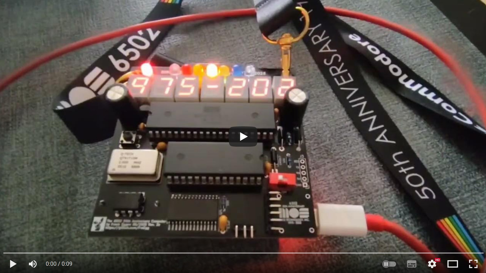

# The MOS 6502 – 50th Anniversary Computer Badge (1975–2025)

## Ein Retro‑Computer im Badge‑Format für 8‑Bit‑6502‑Fans

Von Frank Eggen

👉 [English Version](README.md)

[](https://youtu.be/MOvFbZeAMVU)

---

Basierend auf einer Idee von **Lee Hart, Daryl Rictor und Josh Bensadon** (neu aufgelegt und aktualisiert).
👉 Originalprojekt: [sunrise-ev.com/6502.htm](http://www.sunrise-ev.com/6502.htm)

---

## Inhaltsverzeichnis

* [50 Jahre 8‑Bit Mikroprozessor MOS 6502](#50-jahre-8bit-mikroprozessor-mos-6502)

* [Was ist das Computer Badge?](#was-ist-das-computer-badge)
  
  * [Varianten](#varianten)
  * [Wofür kannst Du es nutzen?](#wofür-kannst-du-es-nutzen)
  * [Technische Ausstattung im Überblick](#technische-ausstattung-im-überblick)

* [Stückliste (BOM)](#stückliste-bom)

* [Montage](#montage)

* [Jumper‑Optionen](#jumper-optionen)

* [Inbetriebnahme](#inbetriebnahme)

* [Schaltplan](#schaltplan)

* [Speicher](#speicher)

* [Eingabe / Ausgabe](#eingabe--ausgabe)

* [LED‑Anzeige](#led-anzeige)

* [Serieller Port](#serieller-port)

* [Softwarebeschreibung](#softwarebeschreibung)

* [6502 Badge – Monitor- & Referenzhandbuch](#6502-badge--monitor--referenzhandbuch)
  
  * [Monitorbefehle](#monitorbefehle-monitor-commands)
  * [HEX‑Dump](#hex-dump-hex-dump)
  * [Speicher bearbeiten](#speicher-bearbeiten-edit-memory)
  * [Speicher verschieben](#speicher-verschieben-move-memory)
  * [Speicher einfügen](#speicher-einfügen-insert-memory)
  * [Ausführen](#ausführen-execute)
  * [Disassemblieren](#disassemblieren-list)
  * [Textausgabe](#textausgabe-text-dump)
  * [LED‑Text setzen](#led-text-setzen-set-led-text)
  * [Upload (XMODEM)](#upload-xmodem)
  * [Download (XMODEM)](#download-xmodem)
  * [Version anzeigen](#version-anzeigen)
  * [Geschütztes Herunterfahren](#geschütztes-herunterfahren-protected-power-down)
  * [Mini‑Assembler](#mini-assembler)
  * [Hilfe](#hilfe)

* [EhBASIC: Kaltstart & Warmstart](#ehbasic-kaltstart--warmstart)

* [EhBASIC‑Kurzübersicht & Schlüsselwörter](#ehbasic-kurzübersicht--schlüsselwörter)

* [LED‑Betrieb (LED Operations)](#led-betrieb-led-operations)

* [Serielle Ein-/Ausgabe (Serial Operations)](#serielle-ein-ausgabe-serial-operations)

* [Systemspeicherbelegung](#systemspeicherbelegung-system-memory-usage)

* [Quellcode‑Organisation & Build‑Hinweise](#quellcode-organisation--build-hinweise)

* [Downloads / Firmware / Manuals](#downloadsfirmwaremanuals)

* [Bestellung](#bestellung)

* [Haftungsausschluss](#haftungsausschluss)

* [Spenden](#spenden)

* [Danksagung](#danksagung)

---

## 50 Jahre 8‑Bit Mikroprozessor MOS 6502


Der legendäre **MOS 6502** wurde 1975 vorgestellt und veränderte die Welt der Computer.
Er brachte Leistung zum kleinen Preis und machte den Siegeszug der **Homecomputer** möglich.

Bekannte Systeme mit 6502:

* Apple II
* Commodore VIC‑20 & C64
* Nintendo NES
* BBC Micro
* Atari VCS

👉 Mehr zur Geschichte: [team6502.org](https://www.team6502.org)

---

## Was ist das Computer Badge?

Der **MOS 6502 50th Anniversary Computer Badge** ist eine **minimalistische Neuauflage** des Originals – kompatibel, aber mit modernen Bauteilen leicht nachzubauen.

### Highlights

* **W65C02S Mikroprozessor @ 2 MHz**
* **32 KiB RAM** mit Batterie‑Backup
* **32 KiB EPROM** mit Floating‑Point BASIC + 6502‑Monitor
* **7‑stellige 7‑Segment‑LED‑Anzeige + 7 LEDs** für Effekte
* **USB‑C Seriell TTL (CH340)** – direkt am PC nutzbar
* **DC/DC‑Step‑Up‑Modul** für stabilen Akkubetrieb
* **CR2032‑Batterie** für SRAM‑Datenerhalt

> Voll funktionsfähig, programmierbar in **Assembler** oder **BASIC** – und trotzdem klein genug, um als Retro‑Namensschild getragen zu werden.

### Varianten

**Badge‑Version**


* 7,62 × 10,16 cm (3 × 4 Zoll) – klassisches Badge‑Format

**Small‑Version**


* 8,15 × 8,2 cm – kompakter, technisch identisch

> **Hinweis:** Falls das Bild nicht angezeigt wird, prüfe bitte den Pfad `images/PCB_Layout_V1_Small.png`.

### Wofür kannst Du es nutzen?

* Als **Retro‑Namensschild** mit Laufschrift Deiner Wahl
* Zum **Feiern von 50 Jahren 6502 & der Homecomputer‑Ära**
* Als **Lehrprojekt** für Assembler, BASIC und Hardware‑Nostalgie
* Zum **Tüfteln & Spaßhaben** mit minimaler Teilezahl
* Einfach als **cooles Sammlerstück** zum Jubiläum

### Technische Ausstattung im Überblick

* W65C02S @ 2 MHz
* 32 KiB RAM mit Batterie‑Backup
* 32 KiB EPROM (BASIC + Monitor)
* 2× 8‑Bit‑Ausgangslatches
* 7‑stellige 7‑Segment‑LED‑Anzeige + 7 LEDs
* USB‑C‑zu‑TTL CH340 UART‑Adapter (BTE17‑06B)
* DC/DC 5 V Step‑Up Boost Converter
* Ladefunktion für 3× AA NiCd‑Akkus

👉 Damit hast Du ein **vollwertiges Retro‑System** in der Hand – minimalistisch, lehrreich und ein echter Hingucker auf jedem Nerd‑Treffen. 😎

---

## Stückliste (BOM)

| Pos. | Referenz           | Menge | Wert                   | Kommentar                                                                                                        | Beschreibung                                  | Datenblatt                                                                                                        |
|:----:|:------------------ | -----:|:---------------------- |:---------------------------------------------------------------------------------------------------------------- |:--------------------------------------------- |:----------------------------------------------------------------------------------------------------------------- |
| 1    | Platine            | 1     | –                      | Badge / Small Version                                                                                            | 50th Anniversary Computer Badge PCB           | –                                                                                                                 |
| 2    | BT1                | 1     | Batteriehalter         | –                                                                                                                | Batteriehalter Keystone für 3 × AA 1,2 V NiCd | [Link](https://www.digikey.de/de/products/detail/keystone-electronics/106/27386)                                  |
| 3    | BT2                | 1     | Batteriehalter         | –                                                                                                                | CR2032 horizontal, Durchkontaktierung         | [Link](https://www.digikey.de/de/products/detail/keystone-electronics/2464/303813)                                |
| 4    | C1                 | 1     | 100 pF                 | –                                                                                                                | Keramik, Disc D3,4 mm, P2,50 mm (THT)         | [Link](https://www.digikey.de/en/products/detail/vishay-beyschlag-draloric-bc-components/K101K10X7RF5UH5/2356746) |
| 5    | C2, C4             | 2     | 470 µF                 | –                                                                                                                | Elektrolyt, radial D8,0 mm, P3,50 mm (THT)    | [Link](https://www.digikey.de/en/products/detail/rubycon/16ZLH470MEFC8X11-5/3563382)                              |
| 6    | C3, C5, C6, C7, C8 | 5     | 100 nF                 | –                                                                                                                | Keramik, Disc D4,7 mm, P5,00 mm (THT)         | [Link](https://www.digikey.de/en/products/detail/kemet/C322C104M5U5TA/818107)                                     |
| 7    | D1, D2, D3         | 3     | 1N5817                 | Schottky‑Diode                                                                                                   | DO‑41 (THT)                                   | [Link](https://www.digikey.de/de/products/detail/smc-diode-solutions/1N5817/21705460)                             |
| 8    | D4                 | 1     | 1N4148                 | **Nicht bestücken – brücken!**                                                                                   | DO‑35 (THT)                                   | [Datenblatt](https://assets.nexperia.com/documents/data-sheet/1N4148_1N4448.pdf)                                  |
| 9    | J1                 | 1     | 5 V DC/DC Step‑Up      | Mit Pin‑Header auf Platine löten                                                                                 | Converter Step‑Up 5 V (10,5 × 11 mm)          | [Link](https://de.aliexpress.com/item/1005005624977910.html)                                                      |
| 10   | J2                 | 1     | CH340N USB‑zu‑TTL      | Mit Pin‑Header auf Platine löten                                                                                 | CH340N SOP‑8 USB‑zu‑TTL‑Modul                 | [Link](https://de.aliexpress.com/item/1005009386863437.html)                                                      |
| 11   | J3                 | 1     | Stiftleiste            | Nur für Bastler                                                                                                  | Pin‑Header 1×05, 2,54 mm, vertikal            | –                                                                                                                 |
| 12   | LED1, LED7         | 2     | LED 3,0 mm (weiß)      | –                                                                                                                | LED D3,0 mm (THT)                             | [Link](https://www.digikey.de/en/products/detail/seoul-semiconductor-inc/LW520AS/2770221)                         |
| 13   | LED2               | 1     | LED 3,0 mm (rot)       | –                                                                                                                | LED D3,0 mm (THT)                             | [Link](https://www.digikey.de/en/products/detail/american-bright-optoelectronics-corporation/BL-B5134/20506048)   |
| 14   | LED3               | 1     | LED 3,0 mm (orange)    | –                                                                                                                | LED D3,0 mm (THT)                             | [Link](https://www.digikey.de/en/products/detail/rohm-semiconductor/SLR-56DUT32/2337242)                          |
| 15   | LED4               | 1     | LED 3,0 mm (gelb)      | –                                                                                                                | LED D3,0 mm (THT)                             | [Link](https://www.digikey.de/en/products/detail/american-bright-optoelectronics-corporation/BL-B3134/20506076)   |
| 16   | LED5               | 1     | LED 3,0 mm (grün)      | –                                                                                                                | LED D3,0 mm (THT)                             | [Link](https://www.digikey.de/en/products/detail/american-bright-optoelectronics-corporation/BL-B2134/20505921)   |
| 17   | LED6               | 1     | LED 3,0 mm (blau)      | –                                                                                                                | LED D3,0 mm (THT)                             | [Link](https://www.digikey.de/en/products/detail/lumimax-optoelectronic-technology/LED5BLU-D/25881229)            |
| 18   | LED8               | 1     | LED 3,0 mm Power (rot) | –                                                                                                                | LED D3,0 mm (THT)                             | [Link](https://www.digikey.de/en/products/detail/american-bright-optoelectronics-corporation/BL-B5134/20506048)   |
| 19   | R1, R6             | 2     | 10 kΩ, 1/4 W           | –                                                                                                                | Axial DIN0204, P5,08 mm (THT)                 | [Link](https://www.digikey.de/de/products/detail/stackpole-electronics-inc/RNMF14FAD10K0/1683413)                 |
| 20   | R2, R3, R4         | 3     | 3,3 kΩ, 1/4 W          | –                                                                                                                | Axial DIN0204, P5,08 mm (THT)                 | [Link](https://www.digikey.de/de/products/detail/stackpole-electronics-inc/RNMF14FTC3K30/2617342)                 |
| 21   | R5                 | 1     | 46 Ω, 1/4 W            | –                                                                                                                | Axial DIN0204, P5,08 mm (THT)                 | [Link](https://www.digikey.de/de/products/detail/stackpole-electronics-inc/RNMF14FTC10R0/2617280)                 |
| 22   | R7–R13             | 7     | 0–560 Ω                | Helligkeit je LED; \~200 Ω bewährt. In der Originalversion ohne Vorwiderstände → ggf. brücken (max. Helligkeit). | Axial DIN0204, P5,08 mm (THT)                 | [Link](https://www.digikey.de/en/products/detail/stackpole-electronics-inc/CFM14JT560R/1742246)                   |
| 23   | R14                | 1     | 1,2 kΩ                 | –                                                                                                                | Axial DIN0204, P5,08 mm (THT)                 | –                                                                                                                 |
| 24   | SEG1–SEG7          | 7     | SC39‑11EWA             | Gute Erfahrungen mit Kingbright                                                                                  | 7‑Segment Sx39‑1xxxxx (THT)                   | [Link](https://www.digikey.de/en/products/detail/kingbright/SC39-11EWA/3084564)                                   |
| 25   | SW1                | 1     | Reset‑Taster           | –                                                                                                                | Taster 6 mm, H4,3 mm (THT)                    | [Link](https://www.digikey.de/de/products/detail/apem-inc/MJTP1230/1798037)                                       |
| 26   | SW2                | 1     | Schalter On/Off        | –                                                                                                                | DIP‑Schalter SPST, 7,62 mm, P2,54 mm (THT)    | [Link](https://www2.mouser.com/ProductDetail/Wurth-Elektronik/418127270901?qs=wr8lucFkNMUHAgaqq%2FoMmA%3D%3D)     |
| 27   | U1                 | 1     | EPROM 27C256           | 32 KiB EPROM                                                                                                     | DIP‑28, 15,24 mm (THT)                        | [Link](https://www.digikey.de/de/products/detail/microchip-technology/AT27C256R-70PC/304743)                      |
| 28   | U1 (Sockel)        | 1     | IC‑Sockel DIP‑28       | –                                                                                                                | DIP‑28, 15,24 mm (THT)                        | –                                                                                                                 |
| 29   | U2                 | 1     | W65C02S CPU            | Mikroprozessor                                                                                                   | DIP‑40, 15,24 mm (THT)                        | [Link](https://www.westerndesigncenter.com/wdc/documentation/w65c02s.pdf)                                         |
| 30   | U2 (Sockel)        | 1     | IC‑Sockel DIP‑40       | –                                                                                                                | DIP‑40, 15,24 mm (THT)                        | –                                                                                                                 |
| 31   | U3                 | 1     | 74HC139 (SOP‑16)       | Dual 2‑to‑4 Decoder/Demux                                                                                        | SOP‑16, P1,27 mm (SMD)                        | [Link](https://www.digikey.de/de/products/detail/nexperia-usa-inc/74AHC139PW-Q100J/4020140)                       |
| 32   | U4                 | 1     | CY62256N (SOP‑28)      | 32 KiB SRAM / 8 Bit                                                                                              | SOP‑28, P1,27 mm (SMD)                        | [Link](https://www.digikey.de/de/products/detail/rochester-electronics-llc/CY62256NLL-70ZC/12099783)              |
| 33   | U5                 | 1     | DS1233‑15+ (TO‑92‑3)   | 5 V EconoReset                                                                                                   | TO‑92‑3 (THT)                                 | [Link](https://www.digikey.de/de/products/detail/analog-devices-inc-maxim-integrated/DS1233-15/1196808)           |
| 34   | U6                 | 1     | MAX690xPA              | Supervisor‑IC                                                                                                    | DIP‑8, 7,62 mm (THT)                          | [Link](https://www.digikey.de/de/products/detail/analog-devices-inc-maxim-integrated/MAX694CPA/948163)            |
| 35   | U7, U8             | 2     | 74HC273 (SOIC‑20)      | Octal D‑Flip‑Flop                                                                                                | SOIC‑20W, P1,27 mm (SMD)                      | [Link](https://www.digikey.de/en/products/detail/toshiba-semiconductor-and-storage/74HC273D/6198939)              |
| 36   | X1                 | 1     | Oszillator 2 MHz       | XO 2 MHz, HCMOS/TTL                                                                                              | DIP‑14 (THT)                                  | [Link](https://www.digikey.de/de/products/detail/cts-frequency-controls/MXO45-3C-2M000000/1801885)                |

**Hinweise:**

* **D4** wird nicht bestückt. Bitte **eine Drahtbrücke** setzen.
* Für **U1** und **U2** empfehle ich, **Sockel** zu verwenden.

---

## Montage

Überprüfe zunächst die Teileliste, damit Du sicher alle Komponenten hast. Zur Montage brauchst Du einen **Lötkolben**, **Lötzinn** und **Flussmittel** (für die SMD‑ICs). Eine **Zange**, **Entlötpumpe** und **Entlötlitze** sind ebenfalls hilfreich.

**Empfohlene Reihenfolge:**

1. **SMD‑ICs löten:** U3 (74HC139), U7 & U8 (74HC273), danach U4 (SRAM).
   Tipp: Einen kleinen Tropfen Flussmittel an **Pin 1 oben links** und den **gegenüberliegenden Pin unten rechts** geben, IC positionieren und diese beiden Pins mit etwas Lötzinn fixieren. Sitzt das IC korrekt, alle übrigen Pins mit Flussmittel und wenig Lötzinn einzeln nachlöten. **Achte auf die korrekte Polung/Markierung** (Pin 1‑Marke ↔ Pfeil/Markierung auf der Platine).

2. **Sockel montieren:** U1 (EPROM) und U2 (W65C02S Mikroprozessor).

3. **U6 (MAX690) löten** und die **D4‑Pads brücken** (Draht). Hier **keine Diode** einsetzen.

4. **U5 (DS1233) einsetzen.** Achte auf die Polung!

5. **X1 2 MHz Oszillator** als Taktgeber einlöten.

6. **Dioden D1, D2, D3 (1N5817)** einsetzen.

7. **Widerstände R1–R6** bestücken.

8. **Keramikkondensatoren C1, C3, C5, C6, C7, C8** bestücken.

9. **Elektrolytkondensatoren C2, C4 (470 µF, 10–16 V)** bestücken.

10. **Reset‑Taster SW1** und **DIP‑Schalter SW2 (ON/OFF)** montieren.

11. **Vorwiderstände R7–R13** für LEDs und LED‑Anzeige auf der **Rückseite** löten. Beachte die Hinweise in der **BOM**.

12. **LED1–LED7** (LED‑Leiste) und **LED8** (Power‑LED) einsetzen. **Polung beachten!** Das **eckige Pad** ist die **Kathode**.

13. **J1** (DC/DC Step‑Up 5 V, 10,5 × 11 mm) mit **3‑poligen Stift‑Stift‑Headern (Male‑Male)** auf der **Rückseite** montieren. **Polung beachten.** Die Spule des Step‑Up‑Moduls zeigt **von der Platine weg**.

14. **J2** (CH340N SOP‑8 USB‑zu‑TTL‑Modul) mit **5‑poligem** Stift‑Stift‑Header auf der **Rückseite** verbinden. Ebenfalls **Polung beachten**.

15. **Platine reinigen** (Flussmittelreste nach dem Löten entfernen).

16. Prüfe, ob **alle Bauteile außer den 7‑Segment‑Displays** montiert sind.

17. **7‑Segment‑Displays** einsetzen. **Polung beachten:** Unten **rechts** ist ein kleiner Punkt – **auf der Vorderseite nach unten** ausrichten.

18. **Batteriehalter BT1/BT2** nach Bedarf montieren – **noch keine Batterien/Akkus** einsetzen.
    
    > **Achtung:** **Nur 3× AA NiCd 1,2 V** verwenden! Die Ladeschaltung ist sehr einfach. **Keine Li‑Ion oder NiMH** verwenden – **Brand/Explosionsgefahr!**

19. **U2 (W65C02S CPU)** und das **programmierte U1 (EPROM)** einsetzen.

20. Fertig! Der **MOS 6502 50th Anniversary Computer Badge** ist montiert.

---

## Jumper‑Optionen

Der **MOS 6502 50th Anniversary Computer Badge** besitzt **drei Jumper** für verschiedene Konfigurationen.

1. **JP1 – Prozessortyp**
   Standard: **offen** → konfigurierte Betriebsart für **W65C02S** (Western Design Center). Bei diesem Prozessor liegt an **Pin 1** das **Vector Pull (VPB)**‑Signal an; **nicht** dauerhaft auf **GND** legen!
   Ältere Prozessoren (MOS, Rockwell, UMC, Synertek) benötigen **GND** an Pin 1 → **JP1 schließen**. Verwende möglichst **2 MHz**‑Typen (z. B. MOS 6502**AD**, Rockwell R6502**AP**, UMC UM6502**A**). Getestet ist die Schaltung mit dem **W65C02S**. **CMOS**‑Varianten sind wegen deutlich geringerem Stromverbrauch empfehlenswert (erkennbar am **C**: 65**C**02).
2. **JP2 – Laden der AA‑NiCd‑Akkus**
   Standard: **geschlossen**.
   Möchtest Du **normale 3× AA 1,5 V Batterien** verwenden, **öffne JP2**, damit diese **nicht versehentlich geladen** werden (über USB‑C J2 oder Pin‑Header J3)!
3. **JP3 – Step‑Up‑Überbrückung**
   Standard: **offen**.
   **Schließen**, wenn **kein** DC/DC 5 V Step‑Up‑Boost‑Modul verwendet wird. Dann erhält die Elektronik die Versorgung direkt von **J2 (USB‑C TTL)** oder **J3 (Pin‑Header)**. Das ist **nicht** zu empfehlen, wenn die Versorgung **nicht konstant 5 V** liefert. Mit **stabiler Quelle** (Netzteil/Powerbank) kann auf J1 verzichtet werden. Im reinen **Akku/Batteriebetrieb** ist das **nicht** sinnvoll.

---

## Inbetriebnahme

Jetzt kommt der große Moment:

1. **SW2 auf OFF** stellen.
2. Eine **stabile 5 V‑Quelle** an **J2 (USB‑C)** oder **J3 (Pin‑Header)** anschließen (**Polung beachten!**).
3. Leuchtet die **Power‑LED**, liegt Versorgung an.
4. **SW2 auf ON** schalten → die 7‑Segment‑Anzeige sollte eine Laufschrift wie **„6502 badge for VCF“** oder **„6502 50th Birthday 1975–2025“** zeigen.

**Akku-/Batteriebetrieb testen:**

* **SW2 OFF**, externe 5 V trennen.
* **CR2032** für das SRAM und **3× AA NiCd** einsetzen.
* Im Batteriebetrieb leuchtet die Power‑LED **nicht** bei **SW2 OFF**.
* **SW2 ON** → der Computer startet, die Laufschrift erscheint. ✅

**Laden:**

* Mit externer 5 V‑Quelle über **USB‑C (J2)** oder **J3** werden die **NiCd‑Akkus langsam geladen**.
* Voller Ladevorgang: **ca. 6–8 h**.
* Laufzeit mit vollen Akkus: **ca. 6–12 h**, abhängig von LED‑Helligkeit/Vorwiderständen.

Die Leiterplatte hat **vier Befestigungslöcher** – ideal für **Füße** oder den Einbau in ein **Gehäuse**.

 – ATARI – APPLE – COMMODORE – NINTENDO – BBC MICRO")

Als zusätzliches Highlight kannst Du ein **Lanyard** an den oberen Löchern befestigen und den **Badge** bequem umhängen.

---

## Schaltplan


Der **MOS 6502 50th Anniversary Computer Badge** ist ein **vollständiger minimalistischer Computer**:
6502‑CPU mit **2 MHz**, **32 KiB RAM (U4)** und **32 KiB ROM (U1)**. **U3** bildet die **Adressenlogik** (Chip‑Select) für RAM/ROM sowie die Ansteuerung der LED‑Segmente. Die zwei **74HC273 (U7/U8)** treiben als Latches/Flip‑Flops die LEDs und 7‑Segment‑Anzeige; **Bit 7** dient als **TX** für die serielle Schnittstelle.

Als **RX‑Eingang** dient **Pin 4 (IRQ)** des 6502 (U2). Es handelt sich um eine **softwarebasierte serielle Schnittstelle**; das Handling übernimmt das **OS im ROM**. So konnte auf einen UART verzichtet werden. Die RS‑232‑ähnliche Schnittstelle arbeitet mit **9600 Baud, 8N1** und ist über **J2 (CH340N USB‑zu‑TTL)** mit dem PC verbunden. Unter Windows kann ein **Treiber** erforderlich sein (siehe Hinweise zum CH340N).

---

## Speicher

Das Badge‑RAM (32 KiB) beginnt bei Adresse **\$0000** und reicht bis **\$7FFF**.

| Adresse | Start  | Ende                  |
| ------- | ------ | --------------------- |
| \$8000  | \$FFFF | ROM 32 KiB (EPROM U1) |
| \$0000  | \$7FFF | RAM 32 KiB            |

---

## Eingabe / Ausgabe

Die beiden **74HC273 8‑Bit‑Latches (U7/U8)** übernehmen die Ein-/Ausgabe. Sie teilen sich einen gemeinsamen Takt, der aus einem **Speicherschreibimpuls (RW)** in den ROM‑Adressraum abgeleitet wird. **Alle 8 Datenbusleitungen** und die **niedrigen 8 Adressleitungen** werden in den Latches gespeichert, wann immer ein **Write** auf die Adressen **\$8000–\$FFFF** erfolgt. Diese Latches treiben die **8 Reihen** und **7 Spalten** der **multiplexed LEDs** und **7‑Segment‑Anzeigen** an. Der Schaltplan zeigt die logischen Verbindungen; für das Layout wurden Adress‑ und Datenpins zwischen den Latches gemischt – entscheidend ist, dass **jeder Eingang mit dem richtigen Ausgang** verbunden ist (D0→D0, D5→D5, A4→A4, …).


Dieser „ungewöhnliche“ Aufbau erfüllt mehrere Ziele:

* **Ein einziger Befehl** kann alle **15 LED‑Steuerbits** gleichzeitig aktualisieren (Vermeidung von Flackern).
* **Minimale Hardware** (kein UART nötig).
* **Einfacheres und kleineres** Leiterplattenlayout.

**TX/RX:**
**Bit 7** des Daten‑Latches wird für die LEDs nicht benötigt und dient daher als **TX**. **IRQ** dient mit Software als **RX**. Zusammen ergibt das einen **einfachen, interrupt‑gesteuerten** Software‑Serial‑Port. **Monitor** und **BASIC** sind über diesen Port erreichbar.

---

## LED‑Anzeige

Die **Daten‑Latches** treiben die **Anoden (Segmente)**, die **Adress‑Latches** die **Kathoden (Ziffern)**.

* Datenbits **0–6** wählen die **Segmente A–G** (Bit 7 = **TxD**).
* Adressbits **1–7** wählen die **Kathoden** der **7 Ziffern**.
  Adressbit **0** wählt die **Kathoden** der **7 diskreten LEDs**.

**Pegel:** Anoden **aktiv high**, Kathoden **aktiv low**.
Beispiel: **Segment A** der **linkesten Ziffer** einschalten → Datenbit 3 **high**, Adressbit 1 **low** → **\$08** an **\$80FD** schreiben (auch **\$95FD, \$FEFD** etc. funktionieren; alles **≥ \$8000**).

---

## Serieller Port

TTL‑asynchron (TxD/RxD + GND), **nicht invertiert** (Idle = 5 V = Logik 1). Du kannst entweder einen **TTL↔RS‑232‑Adapter** an **J3** nutzen oder das **CH340N USB‑zu‑TTL‑Modul** auf **J2** aufstecken. Bonus: **5 V**‑Versorgung via USB (gleichzeitig **Laden der NiCd‑Akkus**, wenn **JP2 geschlossen** ist).

**Parameter:** `9600, N, 8, 1` (9600 Baud, keine Parität, 8 Datenbits, 1 Stopbit).

**Senden (TX):**
Schreibe **\$00** (TX=0) oder **\$80** (TX=1) an eine **beliebige Adresse ≥ \$8000**.
**Alle LED‑Segmente aus:** Low‑Byte **\$FF** (z. B. **\$80FF**) → alle 8 Kathoden **high** (inaktiv).
**LED‑Status halten:** Werte im RAM puffern.

**Empfangen (RX):**
RX nutzt **IRQ (active low)**; **U3** invertiert das Signal. Präzise **Timing‑Schleifen** erkennen High‑Pegel (ausbleibender Interrupt).

**Terminal‑Programme:** z. B. **PuTTY** (Windows), **minicom**/**miniterm** (Linux). Für **Copy\&Paste** Quelltext empfiehlt sich **Transmit‑Verlangsamung**:

1. Verzögerung pro Byte: **≈ 50 ms**
2. Verzögerung nach LF/CR: **≈ 500 ms**

Da die Schnittstelle **softwarebasiert** ist, gibt es **keinen FIFO** – zu schnelle Übertragungen führen zu **Fehlern**.

---

## Softwarebeschreibung

Nach dem **Reset** springt der 6502 über den Vektor an **\$FFFC/\$FFFD** in die **Reset‑Routine**. Diese initialisiert **LED‑Anzeige** und **Software‑Serial** und wechselt in den **Maschinensprachen‑Monitor**.

Der **Monitor** arbeitet über den **seriellen Port** (9600 N 8 1) und erzeugt parallel eine **Laufschrift** („6502 badge for VCF“ / „6502 50th Birthday 1975–2025“) sowie einen **„Knight Rider“‑LED‑Effekt**. Während auf Eingaben gewartet wird, läuft die Anzeige kontinuierlich.

---

## 6502 Badge – Monitor- & Referenzhandbuch

Die Eingabe von **`?` + Return** zeigt den **Hilfebildschirm**:


### Monitorbefehle (Monitor commands)

Grundformat einer Befehlszeile:

```
SSSS.EEEE C <Return>
```

* `SSSS`/`EEEE` = Start‑/Endadresse (durch Punkt getrennt)
* `C` = **Befehlssymbol** (nicht‑alphanumerisch)
* `<Return>` = Eingabetaste
  **Hinweis:** Keine Leerzeichen (z. B. `1234.5678L<Return>`)

Adressen können 1–2 Bytes (2–4 Hexziffern) lang sein. Bei mehr als 4 Hexziffern werden **die letzten 4** verwendet. Kürzere Eingaben werden links mit `0` aufgefüllt (`0.3FF` ⇒ `$0000–$03FF`).

Bei einigen Befehlen ist die Adresse **optional**. Der Monitor merkt sich den **zuletzt eingegebenen** Hexwert und **inkrementiert** ihn automatisch. Beispiel:
`1000L<Return>` listet 20 Zeilen ab `$1000`. Ein folgendes `L<Return>` macht weiter; `1000LLL<Return>` listet 60 Zeilen.

`?<Return>` zeigt eine Kurz‑Hilfe:

```
Commands are :
Syntax = {} required, [] optional, HHHH hex address, DD hex data

[HHHH][ HHHH]{Return}         - Hex dump address(s) (bis zu 16 ohne Adresse)
[HHHH]{.HHHH}{Return}         - Hex dump Bereich (16 pro Zeile)
[HHHH]{:DD}[ DD]{Return}      - Datenbytes ändern
[HHHH]{G}{Return}             - Programm ausführen (RTS kehrt zum Monitor zurück)
{HHHH.HHHH>HHHHI}{Return}     - Bereich (2.) nach unten in 1.→3. einfügen
[HHHH]{L}{Return}             - 20 Zeilen disassemblieren
[HHHH]{.HHHH}{L}{Return}      - Bereich disassemblieren
{HHHH.HHHH>HHHHM}{Return}     - Bereich (1.→2.) nach 3. verschieben
{HHHH}[ HHHH]{Q}{Return}      - Textdump Adresse(n)
[HHHH]{.HHHH}{Q}{Return}      - Textdump Bereich (16/Zeile)
{S}[bis zu 32 Textzeichen]{Return} - LED-Nachricht setzen
[HHHH]{U}{Return}             - Upload (PC→SBC, XMODEM/CRC)
[HHHH.HHHH]{X}{Return}        - Download (SBC→PC, XMODEM/CRC)
{V}{Return}                   - Monitorversion
{P*}{Return}                  - Geschütztes Herunterfahren
{!}{Return}                   - Mini-Assembler
{@}{Return}                   - EhBASIC Kaltstart
{#}{Return}                   - EhBASIC Warmstart
{?}{Return}                   - Hilfe anzeigen
```

### HEX‑Dump (Hex Dump)

```
[HHHH][ HHHH]<Return>   - Hexdump Adresse(n) (bis zu 16 ohne Adresse)
[HHHH]{.HHHH}<Return>   - Hexdump Bereich (16 pro Zeile)
```

Zeigt den Rohinhalt des gewählten Speichers in Hex. Varianten:

1. **Nur Startadresse** → nur dieses Byte (mehrere Adressen durch Leerzeichen)
2. **Start–Ende** → Bereich in 16‑Byte‑Zeilen (Beginn je `$xxx0`)
3. **Ohne Adresse** → bis zu 16 Bytes ab letzter Adresse

Beispiel `5.2D<Return>`:

```
0005 - 2D FF 06 - 42 55 7A 68 AE F5 5B FF
0010 - 7C FF 37 FF FF FC DF EF - 8F CB D7 FF FF 5F 19 76
0020 - 36 DA D4 5D EF F3 EA FF - EA E1 E3 65 4B FF
```

### Speicher bearbeiten (Edit Memory)

```
[HHHH]{:DD}[ DD]<Return>   - Datenbytes ändern
```

Schreibt Daten in RAM. Nach der Adresse folgt `:` und mindestens ein Byte `DD` (weitere Bytes durch Leerzeichen; fortlaufend).
Beispiel: `$1000` → `$55` setzen: `1000:55<Return>`.

Schreibzugriffe auf ROM erzeugen **keinen Fehler**, wirken aber **nicht** (auf dem Badge steuern sie die **I/O‑Latches** – siehe oben).

### Speicher verschieben (Move Memory)

```
{SSSS.EEEE>DDDDM}<Return>
```

Kopiert **von** `SSSS` **bis** `EEEE` **nach** `DDDD` (vorwärts).
**Füllen‑Trick:** Erst ein Byte setzen, dann mit *Move* den Rest füllen.

Beispiel `$1000–$1FFF` auf `$00`:

```
1000:00<Return>
1000.1FFE>1001M<Return>
```

Achtung bei Überlappung (Ziel innerhalb der Quelle) – ggf. **Insert** nutzen.

### Speicher einfügen (Insert Memory)

```
{SSSS.EEEE>DDDDI}<Return>
```

Wie *Move*, jedoch **rückwärts** (Kopieren ab `EEEE` nach unten). So lassen sich **Lücken** beliebiger Größe schaffen.

### Ausführen (Execute)

```
[HHHH]{G}<Return>
```

Startet ein Maschinenprogramm. `RTS` (`$60`) kehrt in den Monitor zurück. Ohne Adresse wird die zuletzt gespeicherte verwendet (empfohlen: **explizite** Startadresse, z. B. `1000G`).

### Disassemblieren (List)

```
[HHHH]{L}<Return>          - 20 Zeilen
[HHHH]{.HHHH}{L}<Return>   - Bereich
```

Ohne Adresse: 20 Zeilen ab der zuletzt genutzten Adresse.

### Textausgabe (Text Dump)

```
{HHHH}[ HHHH]{Q}<Return>
[HHHH]{.HHHH}{Q}<Return>
```

Wie *Hex Dump*, aber als **ASCII**. Nützlich, um Text im Speicher zu finden. Nichtdruckbare Zeichen → `.`

### LED‑Text setzen (Set LED Text)

```
{S}[bis zu 32 Zeichen]<Return>
```

Setzt die scrollende LED‑Nachricht (32‑Byte‑Puffer; längere Eingaben werden abgeschnitten). Beispiel: `S6502 badge<Return>` → Anzeige „6502 badge“.

### Upload (XMODEM)

```
[HHHH]{U}<Return>  – Upload PC→Badge (XMODEM/CRC)
```

Speichert ab der angegebenen (oder gemerkten) Adresse.
**Achtung:** Durch den 128‑Byte‑Puffer können **bis zu 127** zusätzliche Bytes am Ende landen – Überschreiben vermeiden. Nur **XMODEM/CRC** unterstützt (kein Checksum/1k).

### Download (XMODEM)

```
[HHHH.HHHH]{X}<Return> – Download Badge→PC (XMODEM/CRC)
```

Sendet den Bereich. Adresse bitte **immer angeben** (gleiche Pufferhinweise). Nur **XMODEM/CRC**.

### Version anzeigen

```
{V}<Return>
```

Beispielausgabe:

```
>V
65C02 Monitor v5.2 (5-27-17) Ready
with Enhanced Basic Interpreter (c) Lee Davison
(Press ? for help)
>
```

### Geschütztes Herunterfahren (Protected Power Down)

```
{P*}<Return>
```

Schaltet die LEDs aus und springt in eine Endlosschleife im ROM – so bleibt der **RAM‑Inhalt** vor dem Ausschalten erhalten.

### Mini‑Assembler

```
{!}<Return>   – Assembler betreten
```

Einfacher RAM‑Assembler (Hex‑Operanden, keine Labels/Arithmetik). Prompt `>` wird zu `!`. Hilfe: `!?`.

Unterstützte Mnemonics u. a.: `ADC AND ASL BCC ... WAI STP BBRx BBSx RMBx SMBx .DB .DW .DS`.
**Hinweis:** WDC‑Opcodes (`WAI`, `STP`, `BBRx/BBSx`, `RMBx/SMBx`) sind im **Badge‑Prozessor** **nicht verfügbar**, werden aber vom Assembler akzeptiert.

---

## EhBASIC: Kaltstart & Warmstart

**Kaltstart** `{@}<Return>` initialisiert RAM und setzt die Obergrenze („top of memory“). Eingabe in **Dezimal**:

* 2048 → 2 KiB RAM
* 32768 → 32 KiB RAM

Beispiel (2 KiB RAM):

```
>@
Memory size ? 2048
1023 Bytes free
Enhanced BASIC 2.22

Ready
```

Die ersten 1 KiB RAM nutzt **Monitor & LED‑Anzeige**; daher bleiben bei 2 KiB gesamt ≈ 1 KiB frei. Mit `SYS<Return>` kehrst Du vom EhBASIC‑Prompt in den Monitor zurück.
**Warmstart** `{#}<Return>` bringt Dich nach `SYS` wieder zu EhBASIC (ohne Neuinitialisierung; RAM‑Programm bleibt erhalten).

---

## EhBASIC‑Kurzübersicht & Schlüsselwörter

EhBASIC von **Lee Davison** (hier angepasst, mit freundlicher Genehmigung). Handbuch: `http://www.sunrise-ev.com/photos/6502/EhBASIC-manual.pdf`. Der Quelltext ist umfangreich kommentiert.

**Stichwortliste (Auszug):**
`ABS AND ASC ATN BIN$ BITCLR BITSET BITTST CALL CHR$ CLEAR CONT COS DATA DEC DEEK DEF DIM DO DOKE ELSE END EOR EXP FN FOR FRE GET GOSUB GOTO HEX$ IF INC INPUT INT IRQ LCASE$ LEFT$ LEN LET LIST LOAD LOG LOOP MAX MID$ MIN NEW NEXT NMI NOT NULL OFF ON OR PEEK PI POKE POS PRINT READ REM RESTORE RETIRQ RETNMI RETURN RIGHT$ RND RUN SADD SAVE SGN SIN SPC( SQR STEP STOP STR$ SWAP SYS TAB( TAN THEN TO TWOPI UCASE$ UNTIL USR VAL VARPTR WAIT WHILE WIDTH + - * / ^ << >> > = <`

* Schlüsselwörter **GROSS** und **ohne Leerzeichen**.
* Zahlen: Integer, Dezimal oder Float; Präfix `$` (Hex) oder `%` (Binär) – z. B. `$0A`, `1`, `-142`, `96.3`, `2.718E-3`.
* Variablen: numerisch, `Strings$` oder Arrays `(n)`; Strings in Anführungszeichen (`"Hello world"`).

---

## LED‑Betrieb (LED Operations)

Der Monitor enthält neue Routinen zum **Refresh** der scrollenden **7‑Segment‑Ziffern** sowie der **diskreten LEDs**. Grundprinzip: Adress‑Latch auf erste Stelle setzen → Bitmuster aus RAM holen → in Puffer schreiben → kurz einschalten → nächste Stelle usw.; zyklisch wiederholen (Persistence of Vision).
Für **Scrollen** wird der **Startzeiger** periodisch verschoben (Geschwindigkeit = Anzahl der Refreshzyklen zwischen Verschiebungen). Während **Eingabewartezeiten** läuft die Anzeige flüssig; bei Zeichenempfang gibt es kurze Unterbrechungen.

**Quellen:** `LEDdrive.asm`, `font.asm`.

**Wichtige RAM‑Adressen (Variablen):**

```
Lbuff  = $02A0 ; LED-Textpuffer (max. 32 Bytes)
LDbuff = $02C0 ; Puffer diskrete LEDs (max. 32 Bits)
Lptr   = $E2   ; LED-Zeiger (0..31)
Ldig   = $E3   ; Digit-Zähler (0..7; 0 = diskrete LEDs)
Lscn   = $E4   ; Scan-Delay (Helligkeit/Flicker) – 0..255, 0=Display-Refresh aus
Lscl   = $E5   ; Scroll-Delay – 0..255, 0=statisch
Lscnc  = $E6   ; Scan-Zähler (läuft von Lscn runter)
Lsclc  = $E7   ; Scroll-Zähler (läuft von Lscl runter)
LEDchk1 = $E8  ; Konfig-Checksumme 1
LEDchk2 = $E9  ; Konfig-Checksumme 2
```

`Lbuff`/`LDbuff` sind **synchron** (Stelle 0–31). Setze `Lscn=$00`, um den **Monitor‑Refresh** zu deaktivieren (für eigene LED‑Routinen).
`LEDchk1=$A5` **und** `LEDchk2=$5A` verhindern das Überschreiben der Puffer bei Reset (Standardtext sonst „6502 badge for VCF“ + „Knight Rider“). Mit *Edit Memory* kannst Du die Flags setzen, damit beim nächsten Reset initialisiert wird.

---

## Serielle Ein-/Ausgabe (Serial Operations)

Es gibt drei **Monitor‑Subroutinen** für serielle I/O (`JSR`). Adressen unterscheiden sich je nach **ROM‑Version** (`V`‑Befehl):

* **Serial\_Output** (`$EAE8` *oder* `$EAEC`) – sendet 1 Byte (im Akku); `X/Y` bleiben erhalten.
* **Serial\_Input**  (`$EB35` *oder* `$EB39`) – blockierendes Lesen; Byte im Akku; `X/Y` unverändert; Flags `Z/N` gemäß Wert.
* **Scan\_Input**    (`$EB4C` *oder* `$EB50`) – nicht blockierend; keine Eingabe → Carry **gelöscht**; bei Eingabe: Byte in `A`, `Z/N` gesetzt, Carry **gesetzt**.

---

## Systemspeicherbelegung (System Memory Usage)

**Zero Page**

| Bereich   | Nutzung           |
| ---------:| ----------------- |
| \$00–\$13 | EhBASIC           |
| \$14–\$31 | frei              |
| \$32–\$3F | Monitor‑Variablen |
| \$40–\$5A | frei              |
| \$5B–\$DF | EhBASIC           |
| \$E2–\$E9 | LED‑Treiber       |
| \$EA–\$ED | Serieller Treiber |
| \$EF–\$FF | EhBASIC           |

**RAM**

| Bereich       | Nutzung                                |
| -------------:| -------------------------------------- |
| \$0100–\$01FF | System‑Stack                           |
| \$0200–\$027F | Serial Receive Ring‑Buffer             |
| \$02A0–\$02DF | LED‑Puffer                             |
| \$0300–\$037F | Monitor‑Eingabepuffer                  |
| \$0390–\$03FF | EhBASIC‑Eingabepuffer                  |
| \$0400–\$7FFF | Nutzer‑RAM / EhBASIC‑Programm (32 KiB) |

**ROM (je nach Monitor‑Datum)**

| 5‑17‑17 ROM   | 2‑24‑18 ROM   | Beschreibung                |
| ------------- | ------------- | --------------------------- |
| \$C000–\$C1FF | \$C000–\$C1FF | CRC‑Lookup‑Tabelle (XMODEM) |
| \$C200–\$EA9B | \$C200–\$EA9F | EhBASIC                     |
| \$EA9C–\$EB64 | \$EAA0–\$EB68 | Serielle I/O‑Routinen       |
| \$EB65–\$FC39 | \$EB69–\$FC3D | Monitor                     |
| \$FC3A–\$FD93 | \$FC3E–\$FD97 | LED‑Unterstützung           |
| \$FD94–\$FFBE | \$FD98–\$FFC2 | XMODEM                      |
| \$FFBF–\$FFFF | \$FFC3–\$FFFF | Resetcode & Vektoren        |

---

## Quellcode‑Organisation & Build‑Hinweise

Mit Ausnahme von **EhBASIC** stammt die Software von **Daryl Rictor**. Nutzung und Anpassung für **nicht‑kommerzielle Zwecke** erlaubt.

**Dateien:**

* `sbc.asm` – „Makefile“: lädt alle Quellen in der richtigen Reihenfolge/Adresse.
* `basic.asm` – EhBASIC‑Quelle.
* `basldsv.asm` – Patch für Load/Save via XMODEM.
* `sbcOS.asm` – Monitor inkl. Disassembler & Mini‑Assembler.
* `serial.asm` – Software‑Serial‑Treiber.
* `LEDdrive.asm` – LED‑Treiber (Refresh, Scroll, Textfunktionen).
* `font.asm` – LED‑Font (ASCII‑Mapping auf Latch‑Pins).
* `xmodem.asm` – XMODEM‑Protokoll.
* `CRCtable.asm` – CRC‑Lookuptabelle.
* `reset.asm` – Reset/Init; ROM‑Vektoren `$FFFA–$FFFF`; BRK‑Handler (`$00`) → Reset & Monitor.

**Assemblieren (6502 Macroassembler & Simulator, `6502.exe`):**

1. Programm starten

2. `sbc.asm` öffnen (`File → Open → sbc.asm`)

3. Optionen setzen:
   
   * `Assembler` → **Extra byte after BRK**: **deaktivieren**
   * `General` → **65C02, 6501** auswählen

4. Assemblieren (`F7`)

5. Objekt speichern (`File → Save Code`): Intel‑Hex, S‑Record oder Binär
   
   * **Startadresse**: `0xC000` (16 KiB ROM) **oder** `0x8000` (32 KiB ROM)
   * **Endadresse**: `0xFFFF`
   * **OK** → **SAVE**

---

## Downloads/Firmware/Manuals

1. Original Badge Manual von **Lee Hart, Daryl Rictor und Josh Bensadon** → [hier](downloads/badge-manual.pdf) (PDF \~1,6 MiB)
2. Original BadgeOS (Firmware/ROM) → [hier](downloads/BadgeOS.zip) (ZIP \~0,8 MiB)
3. Original EhBASIC Manual → [hier](downloads/EhBASIC-manual.pdf) (PDF \~0,5 MiB)
4. Schaltplan des **MOS 6502 – 50th Anniversary Computer Badge (1975–2025)** → [hier](downloads/Schematic_PCB_Display_2.0a.pdf) (PDF \~0,2 MiB)
5. Platinenlayout (Gerber) → [hier](gerber/)
6. BOM‑Dateien → [hier](bom/)

---

## Bestellung

In Kürze stelle ich das Projekt bei **pcbway.com** als **Shared Project** zur Verfügung.

---

## Haftungsausschluss

Dieses Projekt ist ein **nicht‑kommerzielles Hobbyprojekt**. Der Nachbau und die Nutzung des **MOS 6502 – 50th Anniversary Computer Badge (1975–2025)** erfolgen **ausschließlich auf eigenes Risiko**. Es wird **keinerlei Garantie** für Funktion, Sicherheit, Vollständigkeit oder Fehlerfreiheit übernommen. Der Ersteller (Frank Eggen) haftet **nicht** für Schäden, Verluste oder Folgeschäden, die aus dem Nachbau oder der Verwendung entstehen können.

---

## Spenden

Ich habe viele Stunden an diesem Projekt gearbeitet. Wenn Du diese Arbeit unterstützen möchtest, kannst Du mir **etwas für die Kaffeekasse** spenden. Vielen Dank!
[👉 Paypal‑Spende](https://www.paypal.com/donate/?cmd=_s-xclick&hosted_button_id=Q8HXKYARXKT4L&ssrt=1714757590172)

---

## Danksagung

1. Dieses Projekt basiert auf der Idee von **Lee Hart, Daryl Rictor und Josh Bensadon** → Originalprojekt: [sunrise-ev.com/6502.htm](http://www.sunrise-ev.com/6502.htm). Vielen Dank an die ursprünglichen Entwickler für ihre Pionierarbeit – und besonders an **Lee Hart** für viele hilfreiche Tipps während der Überarbeitung. 🙏
2. **Chuck Peddle** und sein Team bei **MOS** (u. a. Terry Holdt, Wil Mathys, Rod Orgill, Harry Bawcom, Sydney Anne Holt, Walt Eisenhower, John Paivinen), die den 6502 möglich machten → [team6502.org](https://www.team6502.org).
3. **Bill Mensch**, Gründer des **Western Design Center**, der den 6502 bis heute ermöglicht, dokumentiert und weiterentwickelt → [westerndesigncenter.com](https://www.westerndesigncenter.com).
4. **Ben Eater** für sein Projekt **„Build a 6502 computer“** → [eater.net/6502](https://eater.net/6502).


