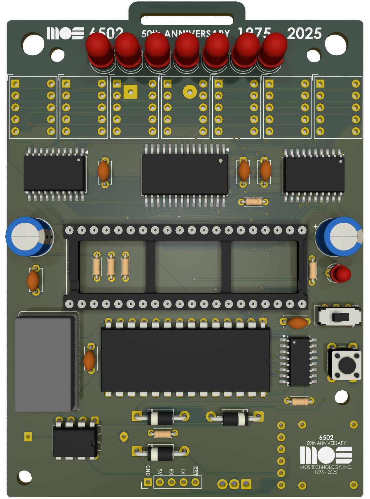
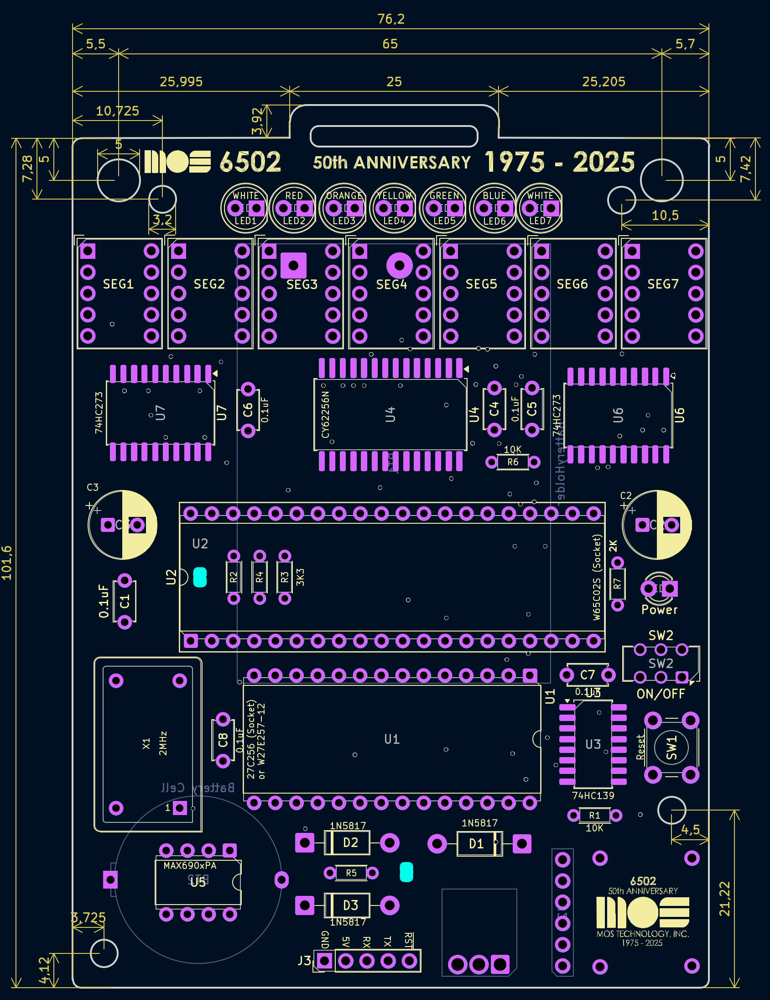
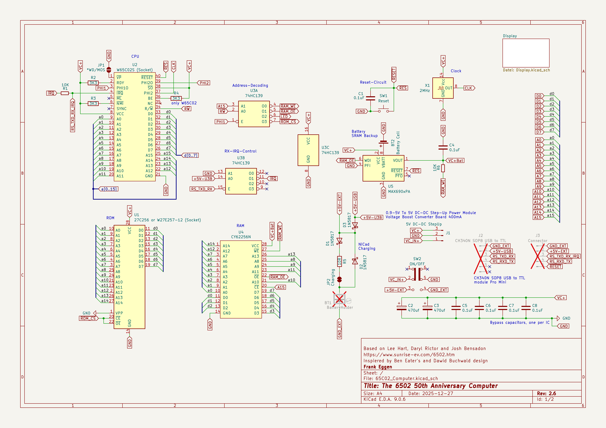
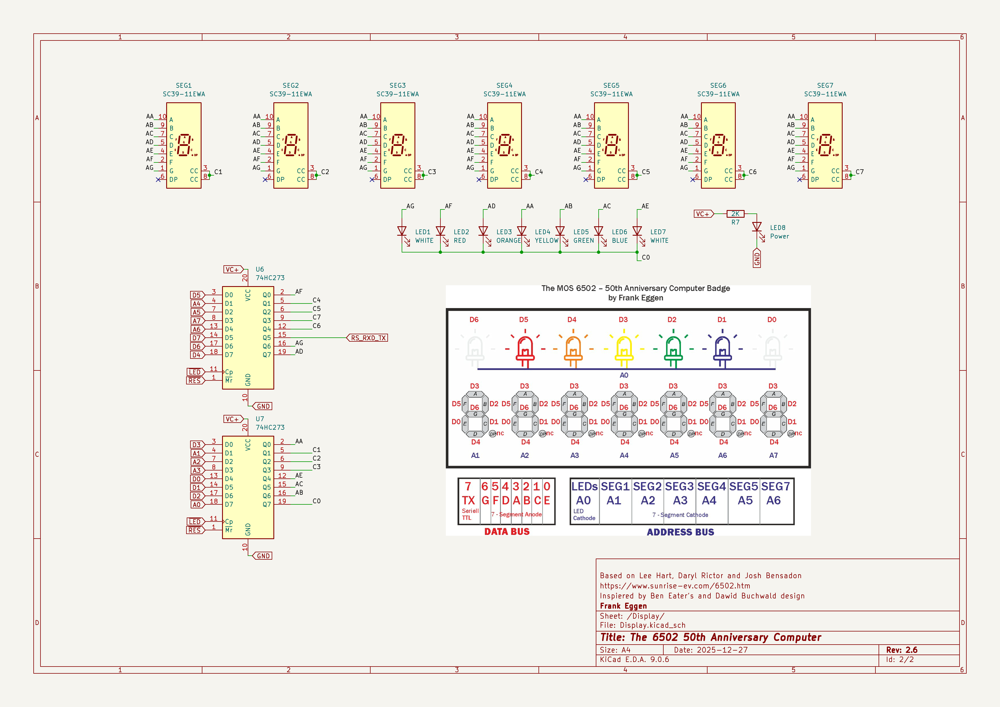

# The MOS 6502 – 50th Anniversary Computer Badge (1975–2025)

## Ein Retro-Computer im Badge-Format für 8-Bit 6502 Fans

Von Frank Eggen (Final-Version 2.6)

👉 [English Version](README.md)

---

Basierend auf einer Idee von **Lee Hart, Daryl Rictor und Josh Bensadon** (neu aufgelegt und aktualisiert).
👉 Originalprojekt: [sunrise-ev.com/6502.htm](http://www.sunrise-ev.com/6502.htm)

---

## Inhaltsverzeichnis

1. [Über das Projekt](#50-jahre-8-bit-mikroprozessor-mos-6502)
2. [Features & Hardware](#technische-ausstattung-im-überblick)
3. [Stückliste (BOM)](#stückliste--bill-of-materials-bom)
4. [Montageanleitung](#montage)
5. [Jumper-Konfiguration](#jumper-optionen)
6. [Inbetriebnahme & Erster Test](#lass-es-uns-arbeiten-sehen)
7. [Technische Details (Architektur & I/O)](#technische-details-schaltplan--architektur)
8. [Software & Monitor-Handbuch](#softwarebeschreibung)
9. [EhBASIC](#ehbasic-kaltstart--warmstart)
10. [System-Interna (für Entwickler)](#system-interna-für-entwickler)
11. [Downloads & Links](#downloads-firmware-manuals)
12. [FAQ / Fehlerbehebung](#fehlerbehebung)
13. [Rechtliches & Danksagung](#haftungsausschluss)

---

## 50 Jahre 8-Bit Mikroprozessor MOS 6502

Der legendäre **MOS 6502** wurde 1975 vorgestellt und veränderte die Welt der Computer nachhaltig. Er brachte Leistung zum kleinen Preis und machte den Siegeszug der **Homecomputer** erst möglich.

Bekannte Systeme mit 6502:

* Apple II
* Commodore VIC-20 & C64
* Nintendo NES
* BBC Micro
* Atari VCS

👉 Mehr zur Geschichte: [team6502.org](https://www.team6502.org)

---

### Was ist das Computer Badge?

Der **MOS 6502 50th Anniversary Computer Badge** ist eine **minimalistische Neuauflage** eines 8-Bit-Mikrocomputers mit 6502-CPU im Badge-Format. Dank moderner Bauteile ist er heute leicht nachzubauen.

**Highlights:**

* **W65C02S Mikroprozessor @ 2 MHz**
* **32K RAM** mit Batterie-Backup
* **32K EPROM** mit Floating-Point BASIC + 6502-Monitor
* **7-stellige 7-Segment-LED-Anzeige + 7 LEDs** für Effekte
* **RS232-kompatible Schnittstelle** für den Datenaustausch
* **USB-C (CH340) serielle TTL-Schnittstelle** – direkt am PC nutzbar
* **DC/DC-Step-Up Modul** für stabilen Akkubetrieb
* **CR2032-Batterie** für SRAM-Datenerhalt

> Voll funktionsfähig, programmierbar in **Assembler** oder **BASIC** – und trotzdem klein genug, um als Retro-Namensschild getragen zu werden.

---

### Varianten

**Badge-Version**

* 7,62 × 10,16 cm (3 × 4 Zoll) – klassisches Badge-Format
* Download des Platinenlayouts PCB V2.6 (Gerber-Datei) > [hier](gerber/) <

---

### Wofür kannst Du es nutzen?

* Als **Retro-Namensschild** mit Laufschrift deiner Wahl
* Zum **Feiern von 50 Jahren 6502 & der Homecomputer-Ära**
* Als **Lehrprojekt** für Assembler, BASIC und Hardware-Nostalgie
* Zum **Tüfteln & Spaßhaben** mit minimaler Teilezahl
* Einfach als **cooles Sammlerstück** zum Jubiläum

---

### Technische Ausstattung im Überblick

* W65C02S @ 2 MHz
* 32K RAM mit Batterie-Backup
* 32K EPROM (BASIC + Monitor)
* 2× 8-Bit-Ausgangslatches
* 7-stellige 7-Segment-LED-Anzeige + 7 LEDs
* 9600, 8n1, serielle Soft-RS232 Schnittstelle
* USB-C zu TTL CH340 UART-Adapter (BTE17-06B)
* DC/DC 5V Step-Up Boost Converter
* Ladefunktion für 3× AA NiCd-Akkus

👉 Damit hast Du ein **vollwertiges Retro-System** in der Hand – minimalistisch, lehrreich und ein echter Hingucker auf jedem Nerd-Treffen. 😎

---

### Stückliste / Bill of Materials (BOM)

Die Liste verwendet empfohlene Bauteile, die ich getestet habe. Natürlich können auch Komponenten anderer Hersteller verwendet werden. Alternative Komponenten habe ich in der aktuellen Stück-/BOM-Liste eingefügt, die man z.B. günstig bei chinesischen Versendern wie AliExpress erhalten kann > [hier XLS](bom/BOM_65C02_Computer.kicad_pcb_v2.6.xls) <.

_Erstellt am 2025-12-27_

| Pos. | Ref      | Wert                          | Menge | Beschreibung                           | Gehäuse                     | Datenblatt                                                                                                                                                    |
|:----:|:-------- |:----------------------------- |:-----:|:-------------------------------------- |:--------------------------- |:------------------------------------------------------------------------------------------------------------------------------------------------------------- |
| 1    | U1       | 27C256 or W27E257-12 (Socket) | 1     | EPROM 256 KiBit (Socket)               | DIP-28_W15.24mm             | [Link](https://www.mouser.com/ProductDetail/Microchip-Technology/AT28C256-25DM-883-815?qs=sGAEpiMZZMv%252BqVJHFCdzIcTLvA16d8bXgqxfSNsRp6tpab4fPFb%2Ffw%3D%3D) |
| 2    | U2       | W65C02S (Socket)              | 1     | W65C02S 8–bit Microprocessor           | DIP-40_W15.24mm_Socket      | [Link](https://www.mouser.com/ProductDetail/Western-Design-Center-WDC/W65C02S6TPG-14?qs=opBjA1TV903lvWo9AEKH5w%3D%3D)                                         |
| 3    | U3       | 74HC139                       | 1     | Dual 2-to-4 line decoder/demultiplexer | SOP-16_4.4x10.4mm_P1.27mm   | [Link](https://www.mouser.com/ProductDetail/Texas-Instruments/SN74HC139PWR?qs=%252BWCn1GN4mVzsIRktqzW%252B6w%3D%3D)                                           |
| 4    | U4       | CY62256N                      | 1     | 256-Kbit (32 K × 8) Static RAM         | SOP-28_8.4x18.16mm_P1.27mm  | [Link](https://www.mouser.com/ProductDetail/Alliance-Memory/CY62256NLL-55SNXIT?qs=byeeYqUIh0MBMJQPS9fE%2Fw%3D%3D)                                             |
| 5    | U5       | MAX690xPA                     | 1     | IC SUPERVISOR 1 CHANNEL 8DIP           | DIP-8_W7.62mm               | [Link](https://www.mouser.com/ProductDetail/Analog-Devices-Maxim-Integrated/MAX690EPA%2b?qs=1THa7WoU59F77SMcFxXEbA%3D%3D)                                     |
| 6    | U6,U7    | 74HC273                       | 2     | IC FF D-TYPE SINGLE 8BIT 20SOIC        | SOIC-20W_7.5x12.8mm_P1.27mm | [Link](https://www.mouser.com/ProductDetail/Nexperia/74HC273D653?qs=sGAEpiMZZMutXGli8Ay4kE3wRMDwmh%2F%252B3McaL2f5IDQ%3D)                                     |
| 7    | R1,R6    | 10K                           | 2     | Metal Film Resistors 10K 1/4W 1%       | Axial                       | [Link](https://www.mouser.com/ProductDetail/SEI-Stackpole/RNMF14FAD10K0?qs=rQFj71Wb1eWBrWvO2mNWLg%3D%3D)                                                      |
| 8    | R2-R4    | 3K3                           | 3     | Metal Film Resistors 3K3 1/4W 1%       | Axial                       | [Link](https://www.mouser.com/ProductDetail/SEI-Stackpole/RNMF14FTC3K30?qs=FESYatJ8odL%252B4KIkrQ9kpA%3D%3D)                                                  |
| 9    | R5       | 10R                           | 1     | Metal Film Resistors 10R 1/4W 1%       | Axial                       | [Link](https://www.mouser.com/ProductDetail/SEI-Stackpole/RNMF14FTC56R0?qs=FESYatJ8odI5g4wJmGs6ow%3D%3D)                                                      |
| 10   | R7       | 2K                            | 1     | Metal Film Resistors 2K 1/4W 1%        | Axial                       | [Link](https://www.mouser.com/ProductDetail/SEI-Stackpole/RNMF14FTC2K00?qs=FESYatJ8odKlooj85fXxuA%3D%3D)                                                      |
| 11   | C1,C4-C8 | 0.1uF                         | 6     | CAP CER 0.1UF 50V Z5U RADIAL           | C_Disc_D4.7mm_W2.5mm        | [Link](https://www.mouser.com/ProductDetail/KEMET/C322C104M5U5TA?qs=CDCeLP2tGBsLrnt3J6Fqow%3D%3D)                                                             |
| 12   | C2,C3    | 470uF                         | 2     | Electrolytic Caps LOW IMPEDANCE        | CP_Radial_D8.0mm_P3.50mm    | [Link](https://www.mouser.com/ProductDetail/Rubycon/16ZLH470MEFC8X11.5?qs=T3oQrply3y9vdBt%2FBJoVxg%3D%3D)                                                     |
| 13   | D1-D3    | 1N5817                        | 3     | 20V 1A Schottky Barrier Rectifier      | D_DO-41_SOD81               | [Link](https://www.mouser.com/ProductDetail/Taiwan-Semiconductor/1N5817?qs=G5AQjGfRJcITga2hz4Rc2w%3D%3D)                                                      |
| 14   | X1       | 2MHz                          | 1     | XTAL OSC XO 2.0000MHZ HCMOS TTL        | Oscillator_DIP-14           | [Link](https://www.mouser.com/ProductDetail/CTS-Electronic-Components/MXO45-3C-2M0000?qs=hbgUSdfWRJVCM8WDm293Vw%3D%3D)                                        |
| 15   | LED1,7   | WHITE                         | 2     | White LED Indication 2.3V              | LED_D5.0mm                  | [Link](https://www.mouser.com/ProductDetail/Lumex/SSL-LX5093UWW?qs=p6VZ%252BklCkRQEgTbVQl4ZVw%3D%3D)                                                          |
| 16   | LED2     | RED                           | 1     | Red LED Indication 2.3V                | LED_D5.0mm                  | [Link](https://www.mouser.com/ProductDetail/LITEON/LTL2F3VEKNT?qs=Sv%252BigzQKaoVYLcEZH8BKGw%3D%3D)                                                           |
| 17   | LED3     | ORANGE                        | 1     | Orange LED Indication 2.3V             | LED_D5.0mm                  | [Link](https://www.mouser.com/ProductDetail/LITEON/LTL-5223?qs=WxFF5lh7QM39C0u211ch5w%3D%3D)                                                                  |
| 18   | LED4     | YELLOW                        | 1     | Yellow LED Indication 2.3V             | LED_D5.0mm                  | [Link](https://www.mouser.com/ProductDetail/Kingbright/WP57YYD?qs=58z0TXQGVSQbwKcOfYiIwA%3D%3D)                                                               |
| 19   | LED5     | GREEN                         | 1     | Green LED Indication 2.3V              | LED_D5.0mm                  | [Link](https://www.mouser.com/ProductDetail/Kingbright/WP56BGD?qs=tMH1uPls0D11B8xP4K7t3g%3D%3D)                                                               |
| 20   | LED6     | BLUE                          | 1     | Blue LED Indication 2.3V               | LED_D5.0mm                  | [Link](https://www.mouser.com/ProductDetail/Kingbright/WP7083QBD-G?qs=vEWui5pQpatbKK552qzGvw%3D%3D)                                                           |
| 21   | LED8     | Power                         | 1     | Red LED Indication (Power) 2.3V        | LED_D3.0mm                  | [Link](https://www.mouser.com/ProductDetail/LITEON/LTL2F3VEKNT?qs=Sv%252BigzQKaoVYLcEZH8BKGw%3D%3D)                                                           |
| 22   | SEG1-7   | SC39-11EWA                    | 7     | 7-segment display, com. cathode        | Sx39-1xxxxx                 | [Link](https://www.mouser.com/ProductDetail/Kingbright/SC39-11EWA?qs=VdjlWU%2FzoOE%2FBaS5v1GsqA%3D%3D)                                                        |
| 23   | SW1      | Reset                         | 1     | SWITCH TACTILE SPST-NO                 | SW_PUSH_6mm                 | [Link](https://www.mouser.com/ProductDetail/Apem/MJTP1230?qs=ooeArD5nza9YuOFpo4pJ2Q%3D%3D)                                                                    |
| 24   | SW2      | ON/OFF                        | 1     | SWITCH SLIDE DPDT 300MA 6V             | JS202011CQN                 | [Link](https://www.mouser.com/ProductDetail/CK/JS202011CQN?qs=LgMIjt8LuD%2Fe%252BE3iTcEFYw%3D%3D)                                                             |
| 25   | J1       | 5V DC-DC                      | 1     | 0.9-5V To 5V Step-Up Module            | THT                         | [Link](https://de.aliexpress.com/item/1005005624977910.html)                                                                                                  |
| 26   | J2       | CH340N                        | 1     | CH340N SOP8 USB to TTL module          | USB-zu-TTL-Modul            | [Link](https://de.aliexpress.com/item/1005009386863437.html)                                                                                                  |
| 27   | J3       | Header                        | 1     | Generic connector, 01x05               | PinHeader 1x05              | -                                                                                                                                                             |
| 28   | JP1      | *WD/MOS                       | 1     | Solder Jumper, 2-pole, open            | -                           | -                                                                                                                                                             |
| 29   | JP2      | Charging                      | 1     | Solder Jumper, 2-pole, closed          | -                           | -                                                                                                                                                             |
| 30   | BT1      | 3x AA                         | 1     | Holder 3x AA (Achtung: Nur NiCd!)      | Keystone_3xAA               | [Link](https://www.mouser.com/ProductDetail/Keystone-Electronics/2464?qs=3CbvriavsLDuYK6W9WnmCg%3D%3D)                                                        |
| 31   | BT2      | CR2032                        | 1     | Holder CR2032 (Backup)                 | Panasonic_CR2032            | [Link](https://www.mouser.com/ProductDetail/Keystone-Electronics/106?qs=Q3RoVmURDolnMuconA2vXg%3D%3D)                                                         |

#### Hinweise:

Für die ICs U1 und U2 wird empfohlen, einen DIP-Sockel zu verwenden.

---

### Montage

Bitte überprüfe die Teileliste, um sicherzugehen, dass Du alle Teile hast. Zur Montage benötigst Du einen Lötkolben, Lötzinn und Flussmittel für die SMD-ICs. Am besten auch eine Zange, Entlötpumpe und Entlötlitze bereithalten.

Ich empfehle die folgende Reihenfolge bei der Montage:

1. **SMD-ICs:** Zuerst die SMD-ICs auf die Platine löten: U3 (74HC139), U6, U7 (74HC273) und dann U4 (SRAM).
   *Mein Tipp:* Jeder hat seine eigene Methode für SMDs. Ich setze immer einen Tropfen Flussmittel auf den ersten Pin (oben links) und den letzten Pin (unten rechts). Dann lege ich das IC auf die Lötpunkte und fixiere diese beiden Pins mit etwas Lötzinn. Wenn das IC gut sitzt, gebe ich Flussmittel auf die restlichen Pins und verlöte diese einzeln. Achte unbedingt auf die **Polung**: Pin 1 ist dort, wo der Pfeil/Punkt auf der Platine markiert ist.

2. **Sockel:** Jetzt die Sockel für U1 (EPROM) und U2 (W65C02S Mikroprozessor) auflöten.

3. **U5:** Löte U5 (MAX690, alternativ MAX692) ein.

4. **Oszillator:** Danach folgt der X1 2MHz Oszillator als Taktgeber.

5. **Dioden:** Setze die Dioden D1, D2, D3 (1N5817) ein (Polung/Ring beachten!).

6. **Widerstände:** Jetzt sind die Widerstände R1 - R7 an der Reihe.

7. **Keramikkondensatoren:** C1, C4, C5, C6, C7 und C8 einlöten.

8. **Elkos:** Es folgen die beiden Elektrolytkondensatoren C2 und C3 mit 470uF (10-16V). Auf die Polarität achten!

9. **Schalter:** Nun fehlen noch der Reset-Button SW1 und der DIP-Schalter SW2 (ON/OFF).

10. **LEDs:** Platziere die LED1-LED7 (LED-Leiste) und LED8 (Power-LED).
    *Achtung:* Auf die **Polung** achten! Das Loch mit dem eckigen Lötpad ist die Kathode (Minus/abgeflachte Seite).

11. **DC/DC-Wandler (J1):** Installiere das Step-Up-Modul auf der Rückseite der Platine (mit 3-poligen Pin-Headern).
    *Wichtig:* Die Spule auf dem Modul muss auf die von der Platine abgewandte Seite zeigen.
    *Option:* Möchtest Du **kein** Step-Up-Modul verwenden, überbrücke Pin 1 und 3 an J1 (Vorsicht: Nicht mit Pin 2 verbinden!). Dies ist nur zu empfehlen, wenn Du das Badge ausschließlich mit stabilen 5V (Labornetzteil oder USB-C) betreibst.

12. **USB-Modul (J2):** Verbinde das CH340N USB-zu-TTL-Modul mit einem 5-poligen Header auf der Rückseite. Auch hier unbedingt auf die korrekte Ausrichtung achten.

13. **Reinigung:** Reinige die Platine von Flussmittelresten.

14. **Displays:** Installiere die 7-Segment-Displays. Der Dezimalpunkt (DP) befindet sich unten rechts; dieser muss auch auf der Platine nach unten zeigen.

15. **Batteriehalter:** Installiere bei Bedarf BT1 und BT2. Setze noch keine Batterien ein!
    **WARNUNG:** Verwende für BT1 **nur 3x AA NiCd 1,2V Akkus**, wenn JP2 geschlossen ist! Die Ladeelektronik ist sehr simpel. Andere Typen (Li-Ion, NiMH) dürfen nicht geladen werden (Brandgefahr!). Bei Verwendung von normalen Batterien muss **JP2 geöffnet** werden.

16. **Chips:** Setze zuletzt das Herzstück U2 (W65C02S CPU) und das programmierte EPROM U1 in die Sockel ein.

---

### Jumper-Optionen

Der Badge hat drei Jumper für die Konfiguration:

1. **JP1 (CPU-Typ):** Wählt den Prozessortyp.
   
   * **Offen (Standard):** Für den W65C02S (Western Design Center). Dieser moderne CMOS-Typ hat an Pin 1 den Ausgang "Vector Pull" (VPB) und darf nicht fest auf Masse gelegt werden.
   * **Geschlossen:** Für ältere NMOS-Typen (MOS, Rockwell, UMC, Synertek), die an Pin 1 Masse (GND) benötigen. Achte bei alten CPUs darauf, eine 2MHz-Variante zu nutzen (z.B. 6502AD, R6502AP).
   * *Empfehlung:* Nutze den **W65C02S** (CMOS). Er verbraucht weniger Strom und das BadgeOS nutzt dessen erweiterten Befehlssatz.

2. **JP2 (Charging):** Steuert das Laden der AA-Akkus.
   
   * **Geschlossen (Standard):** Ladefunktion aktiv. **Nur für NiCd-Akkus!**
   * **Offen:** Ladefunktion deaktiviert. Zwingend erforderlich, wenn normale 1,5V Alkaline-Batterien verwendet werden.

---

## Lass es uns arbeiten sehen!

Nun zum großen Moment.

1. Stelle SW2 auf **OFF**.
2. Schließe eine stabile 5V-Spannungsquelle an (über USB-C J2 oder Pin-Header J3).
3. Schalte SW2 auf **ON**.

Die Power-LED sollte leuchten, und Du wirst mit der Laufschrift **"6502 badge for VCF"** oder **"6502 50th Birthday 1975-2025"** auf dem Display belohnt!

**Akkubetrieb testen:**

1. SW2 auf **OFF**, externe Stromquelle trennen.
2. Setze die CR2032 (SRAM-Backup) und die 3x AA NiCd-Akkus ein.
   *Hinweis:* Im Batteriebetrieb leuchtet die Power-LED bei ausgeschaltetem Gerät (OFF) nicht (im Gegensatz zum Betrieb an externer Quelle).
3. SW2 auf **ON** – der Computer sollte starten.

Lädst Du über USB, dauert ein voller Ladezyklus ca. 6-8 Stunden. Die Laufzeit beträgt 6-12 Stunden.

**Lanyard & Gehäuse:**
Die Platine hat vier Montagelöcher für Füße oder ein Gehäuse. Ein Lanyard kann an den oberen Löchern befestigt werden, um das Badge um den Hals zu tragen.

---

### Technische Details: Schaltplan & Architektur

Schaltplan des **The MOS 6502 – 50th Anniversary Computer Badge** > [hier PDF](downloads/Schematic_v2.6.pdf) <

Das Badge ist ein vollständiger, minimalistischer Computer:

* **CPU (U2):** W65C02S @ 2 MHz.
* **Speicher:** 32KB RAM (U4) und 32KB ROM (U1).
* **Adresslogik (U3):** Der 74HC139 übernimmt das Adress-Decoding für RAM/ROM (CS) sowie die Ansteuerung der LED-Segmente.
* **I/O (U6/U7):** Zwei 74HC273 dienen als Multiplexer und Latches für die LEDs und das 7-Segment-Display. Bit 7 fungiert zusätzlich als TX-Signal.

**Besonderheit RS232:**
Es wird kein UART-Chip verwendet! 

* **RX:** Läuft über den IRQ-Pin (Pin 4) der CPU (invertiert durch U3).
* **TX:** Läuft über Bit 7 des Latches. 
  Das OS emuliert eine **Soft-RS232** (9600 Baud, 8N1). Über den USB-zu-TTL Adapter (CH340) kannst Du das Badge mit modernen PCs verbinden (PuTTY, Minicom).

---

### Speicher-Mapping

| Adresse | Start   | Ende    | Beschreibung     |
|:------- |:------- |:------- |:---------------- |
| **RAM** | `0000h` | `7FFFh` | 32 KB SRAM (U4)  |
| **ROM** | `8000h` | `FFFFh` | 32 KB EPROM (U1) |

---

### Eingabe / Ausgabe & Das "verrückte" Layout

Die beiden Latches (U6/U7) steuern LEDs und I/O. Sie teilen sich einen gemeinsamen Takt, der von einem Schreibimpuls in den Adressraum `8000h - FFFFh` abgeleitet wird.

Um das Layout zu vereinfachen und Hardware zu sparen, sind Daten- und Adressleitungen physisch "wild" gemischt (D0 an D0, A4 an A4, etc.).

**Warum dieser Aufbau?**

1. Aktualisierung aller 15 LED-Steuerbits mit einem einzigen Befehl (kein Flackern).
2. Minimale Hardware (kein UART nötig).
3. Einfacheres Platinenlayout.

#### Ansteuerung der LED-Anzeige

* **Datenbus (Bits 0-6):** Wählt die Segmente (A-G).
* **Datenbus (Bit 7):** TX (Serieller Ausgang).
* **Adressbus (Bits 1-7):** Wählt die Ziffern (Kathoden).
* **Adressbus (Bit 0):** Wählt die diskreten LEDs.

Beispiel: Um Segment A der ganz linken Ziffer einzuschalten, schreibst Du `08h` an Adresse `80FDh`.
*Daten:* `00001000` (08h)
*Adresse:* `11111101` (FDh) -> Offset zur Basis `8000h` = `80FDh`.

**Hinweis zur Firmware:**
Meine Version (`BadgeOS_50th`) unterstützt alle **7 diskreten LEDs**. Die ursprüngliche Firmware von Lee Hart steuerte nur 5 an.

---

### Serieller Port

Der Port nutzt **9600, 8, N, 1**.
Du kannst einen TTL-zu-RS232 Adapter an J3 anschließen oder das USB-Modul (J2) nutzen.

* **Einstellungen Terminal:** 9600 Baud, 8 Data bits, No parity, 1 Stop bit.
* **Verzögerung für Uploads:** Da der Port softwarebasiert ist (kein Hardware-FIFO), brauchst Du beim Einfügen von Text/Code Pausen:
  * 20ms pro Zeichen
  * 200ms nach Zeilenumbruch (LF/CR)

Um TX auf Low zu setzen, schreibe `00h` (Bit 7=0), für High `80h` (Bit 7=1) an eine beliebige Adresse >= `8000h`.

---

## Softwarebeschreibung

Nach dem Reset startet der **Monitor**. Er steuert die Laufschrift ("6502 50th Birthday...") und wartet auf serielle Eingaben.

### Monitor-Befehle (Monitor Commands)

Das Format ist immer: `SSSS.EEEE C <Return>` (Startadresse, Endadresse, Befehl).
Keine Leerzeichen vor dem Befehl!

#### Befehlsübersicht

| Befehl        | Syntax                  | Beschreibung                                    |
|:------------- |:----------------------- |:----------------------------------------------- |
| **Hex Dump**  | `[Start][ Ende]<Ret>`   | Zeigt Speicherinhalt an.                        |
| **Edit**      | `Adresse:DD DD...`      | Schreibt Daten (DD) in den Speicher.            |
| **Go**        | `AdresseG`              | Startet Programm an Adresse (RTS kehrt zurück). |
| **List**      | `AdresseL`              | Disassembliert 20 Zeilen Code.                  |
| **Move**      | `Start.Ende>ZielM`      | Kopiert Speicherbereich (vorwärts).             |
| **Insert**    | `Start.Ende>ZielI`      | Kopiert Speicherbereich (rückwärts/einfügen).   |
| **Text**      | `S[Text]`               | Setzt den Text der LED-Laufschrift.             |
| **Upload**    | `AdresseU`              | Empfängt Datei vom PC (XMODEM/CRC).             |
| **Download**  | `Start.EndeX`           | Sendet Datei an PC (XMODEM/CRC).                |
| **Basic**     | `@` (Kalt) / `#` (Warm) | Startet EhBASIC.                                |
| **Assembler** | `!`                     | Startet den Mini-Assembler.                     |
| **Hilfe**     | `?`                     | Zeigt das Hilfemenü.                            |
| **Shutdown**  | `P*`                    | Geschütztes Herunterfahren (LEDs aus, Loop).    |

#### Detailbeschreibung wichtiger Befehle

**Hex Dump:**

* `5.2D<Return>` zeigt den Bereich von 0005 bis 002D.
* Ohne Adresse werden die nächsten 16 Bytes angezeigt.

**Edit Memory:**

* `1000:55 56 57<Return>` schreibt die Werte 55h, 56h, 57h ab Adresse 1000h.

**Move Memory (Kopieren):**

* `1000.1FFF>2000M` kopiert den Inhalt von 1000h-1FFFh nach 2000h.
* *Trick zum Füllen:* `1000:00` setzen, dann `1000.1FFE>1001M` kopiert die 00 in den gesamten Bereich.

**Mini-Assembler (`!`):**
Einfacher Assembler für Mnemonics.

* `!1000` setzt Startadresse.
* `LDA #FF` assembliert den Befehl.
* Leere Zeile beendet den Assembler.
* *Achtung:* WDC-spezifische Opcodes (WAI, STP) werden akzeptiert, funktionieren aber nur auf CMOS CPUs.

---

### EhBASIC: Kaltstart & Warmstart

**Kaltstart (`@`):**
Initialisiert den Speicher. Frage nach "Memory size?" kann mit `Return` (für max) oder `32768` beantwortet werden.
Mit dem Befehl `SYS` kommst Du zurück in den Monitor.

**Warmstart (`#`):**
Kehrt zu BASIC zurück, ohne das Programm im RAM zu löschen.

EhBASIC ist ein mächtiger Interpreter von Lee Davison. Er unterstützt Floating Point, Arrays, Strings und vieles mehr.

> [EhBASIC Manual Download](downloads/EhBASIC-manual.pdf)

---

### System-Interna (für Entwickler)

#### Wichtige RAM-Adressen (Zero Page & Buffer)

| Bereich   | Nutzung                            |
|:--------- |:---------------------------------- |
| `$00-$13` | EhBASIC                            |
| `$32-$3F` | Monitor-Variablen                  |
| `$E2-$E9` | LED-Treiber                        |
| `$EA-$ED` | Serieller Treiber                  |
| `$02A0`   | `Lbuff` (LED-Textpuffer, 32 Bytes) |
| `$E4`     | `Lscn` (Scan-Delay, 0=Refresh aus) |

#### LED-Treiber Variablen

Um eigene Effekte zu programmieren, sind diese Adressen wichtig:

* `Lptr` ($E2): LED-Zeiger.
* `Lscn` ($E4): Helligkeit/Scan-Speed. Setze auf 0, um den Monitor-Refresh zu stoppen und eigene Routinen zu nutzen.
* `LEDchk1/2` ($E8/$E9): Checksummen ($A5/$5A). Wenn diese nicht stimmen, wird beim Reset der Standardtext geladen.

#### Assemblieren des Quellcodes

Die Software ist in Module unterteilt (`sbc.asm` ist das Hauptfile).
Nutze einen 6502 Macroassembler (z.B. den Simulator `6502.exe`):

1. Öffne `sbc.asm`.
2. Setze "Extra byte after BRK" auf *deaktiviert*.
3. Wähle Prozessor **65C02**.
4. Kompiliere als Binärdatei/Hex für Startadresse `$8000` (32K ROM).

---

## Downloads/Firmware/Manuals

1. **Firmware (50th Edition):** [BadgeOS_32k_50th.rom](downloads/BadgeOS_32k_50th.rom) (BIN 32KB, unterstützt 7 LEDs)
2. **Handbuch (Deutsch):** [Manual_50th_DE_2.6.pdf](https://github.com/FraEgg/The-MOS-6502-50th-Anniversary-Computer-Badge/blob/2.6/downloads/Maunal_50th_DE_2.6.pdf)
3. **Handbuch (Englisch):** [Manual_50th_EN_2.6.pdf](https://github.com/FraEgg/The-MOS-6502-50th-Anniversary-Computer-Badge/blob/2.6/downloads/Manual_50th_EN_2.6.pdf)
4. **Original Firmware:** [BadgeOS.zip](downloads/BadgeOS.zip) (nur 5 LEDs)
5. **Schaltplan:** [Schematic_v2.6.pdf](downloads/Schematic_v2.6.pdf)
6. **Gerber-Dateien:** [PCB Layout](gerber/)
7. **BOM (Excel):** [Stückliste](bom/)
8. **Treiber:** [CH340 USB Driver](https://www.arduined.eu/tag/ch340/)

---

## Bestellung

Das Projekt ist als "Shared Project" bei PCBWay verfügbar:

> [The MOS 6502 – 50th Anniversary Computer Badge @ PCBWay](https://www.pcbway.com/project/shareproject/The_MOS_6502_50th_Anniversary_Computer_Badge_1975_2025_439a8755.html)

---

## Fehlerbehebung

**F: Die Power-LED leuchtet, aber das Display flackert.**
A: Prüfe die Spannung an U2 Pin 8. Sie muss 4,5–5V betragen. Wenn der Step-Up-Wandler <1,2V Input bekommt, bricht er zusammen.

**F: Einige LEDs leuchten dauerhaft oder gar nicht.**
A: Prüfe U6 und U7 (74HC273) auf Lötbrücken oder kalte Lötstellen.

**F: Power-LED an, sonst passiert nichts.**
A:

1. Prüfe U3 (74HC139).
2. Sitzen EPROM (U1) und CPU (U2) richtig? Richtige Firmware drauf?
3. SRAM (U4) und Oszillator (X1) prüfen.

**F: Keine USB-Verbindung (Windows).**
A: Installiere den CH340-Treiber.

**F: CH340-LED leuchtet auch bei ausgeschaltetem Badge (im Akkubetrieb).**
A: Das ist normal. Das Modul wird vom Akku versorgt, um den IRQ-Pin auf High zu halten (sonst startet die CPU nicht). Dies wird in einer künftigen Revision optimiert.

---

## Haftungsausschluss

Dieses Projekt ist ein nicht-kommerzielles Hobbyprojekt. Der Nachbau und die Nutzung des **The MOS 6502 – 50th Anniversary Computer Badge** erfolgen ausschließlich auf eigenes Risiko. Es wird keinerlei Garantie für Funktion, Sicherheit, Vollständigkeit oder Fehlerfreiheit übernommen. Der Ersteller haftet nicht für Schäden, die aus dem Nachbau entstehen.

---

## Spenden

Ich habe viele Stunden in dieses Projekt gesteckt. Wenn Du meine Arbeit unterstützen möchtest:
[☕ Spende für die Kaffeekasse (PayPal)](https://www.paypal.com/donate/?cmd=_s-xclick&hosted_button_id=Q8HXKYARXKT4L&ssrt=1714757590172)

Vielen Dank!

---

## Danksagung

1. **Lee Hart, Daryl Rictor & Josh Bensadon:** Für die geniale Ur-Idee ([sunrise-ev.com](http://www.sunrise-ev.com/6502.htm)).
2. **Team MOS (Chuck Peddle, Bill Mensch, et al.):** Für die Erschaffung des 6502 ([team6502.org](https://www.team6502.org)).
3. **Bill Mensch:** Gründer des Western Design Center ([westerndesigncenter.com](https://www.westerndesigncenter.com)).
4. **Ben Eater:** Für seine inspirierenden "Build a 6502 computer" Videos ([eater.net/6502](https://eater.net/6502)).

