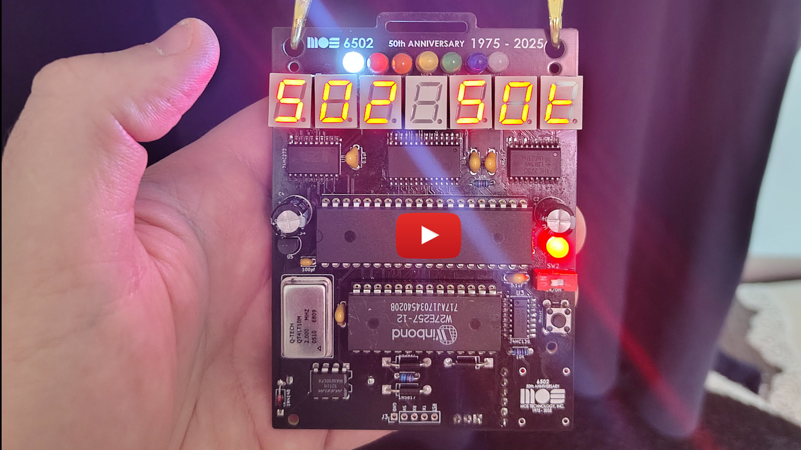
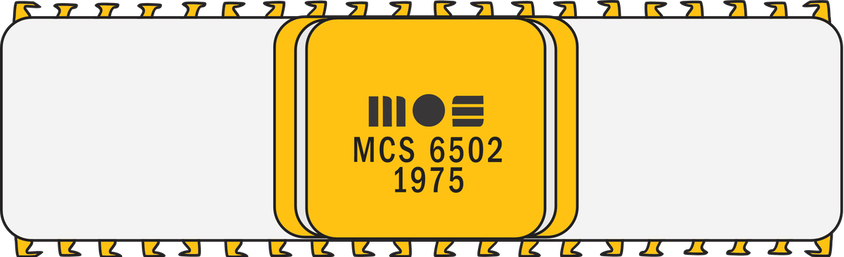
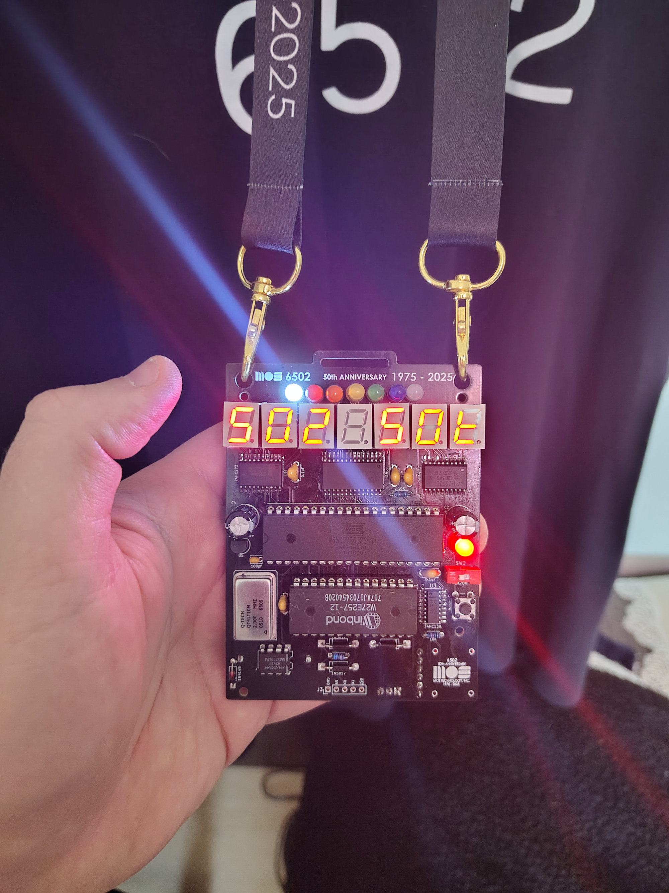
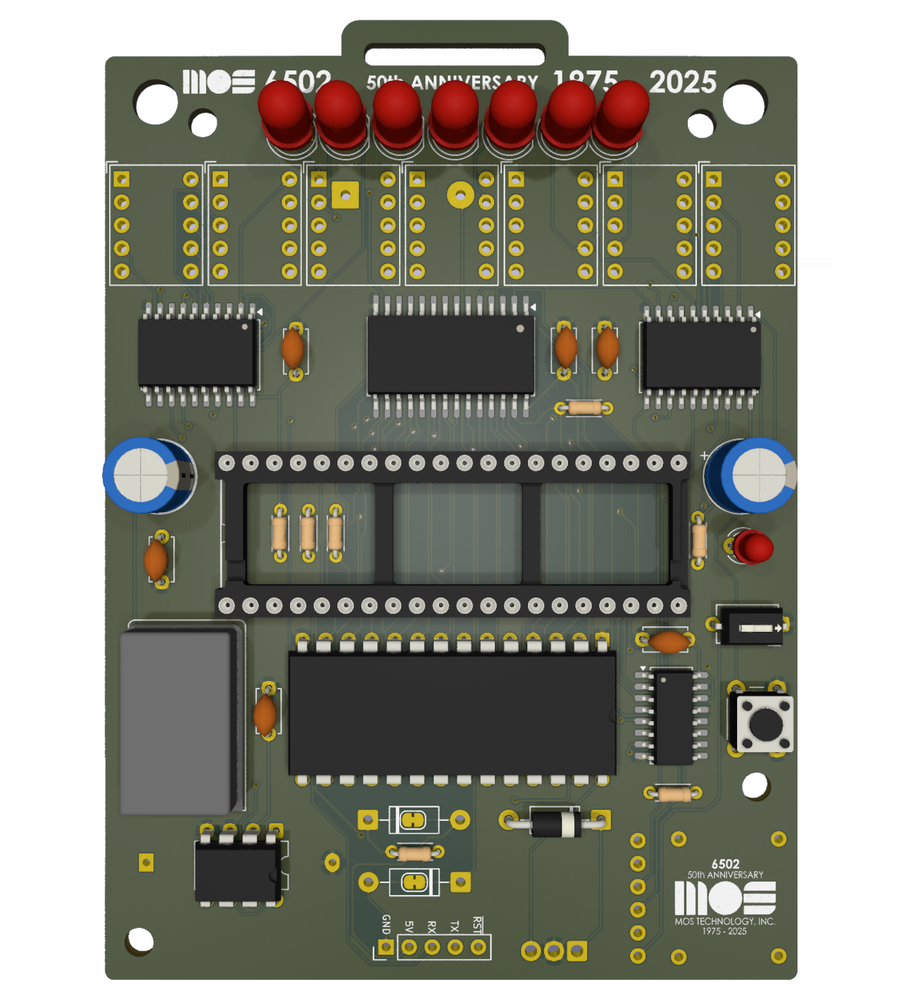
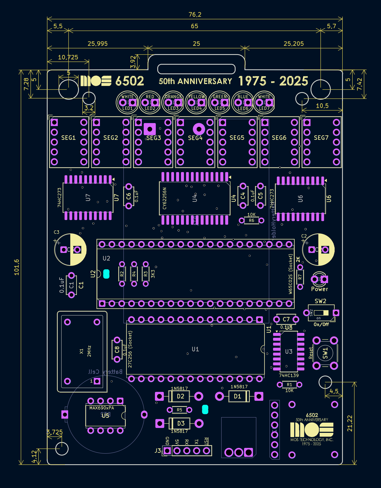
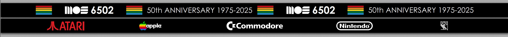
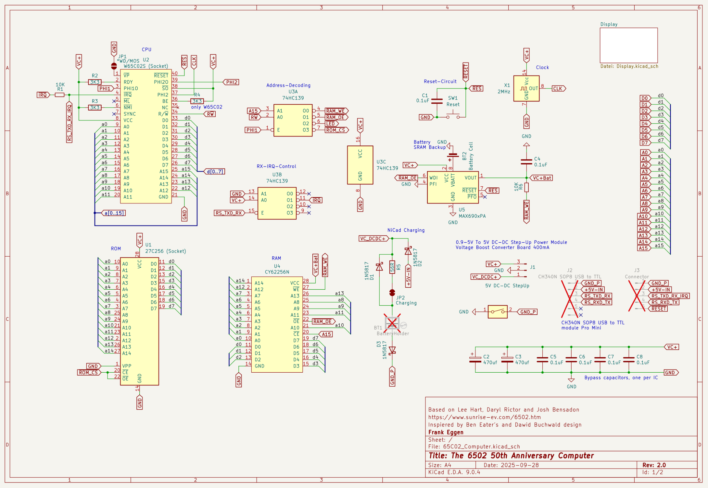
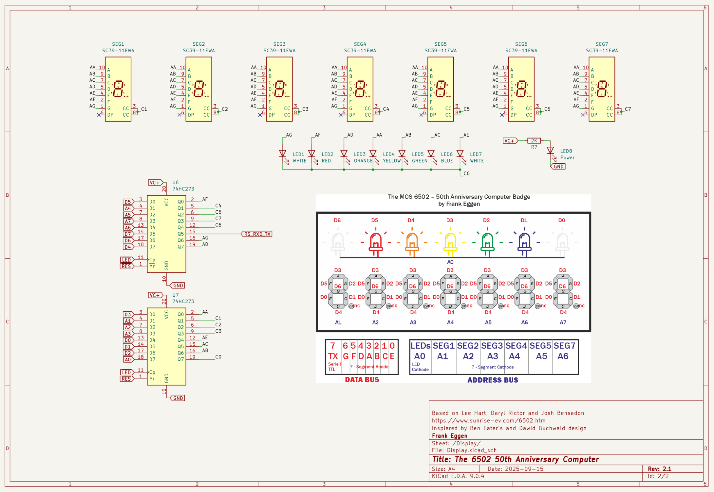
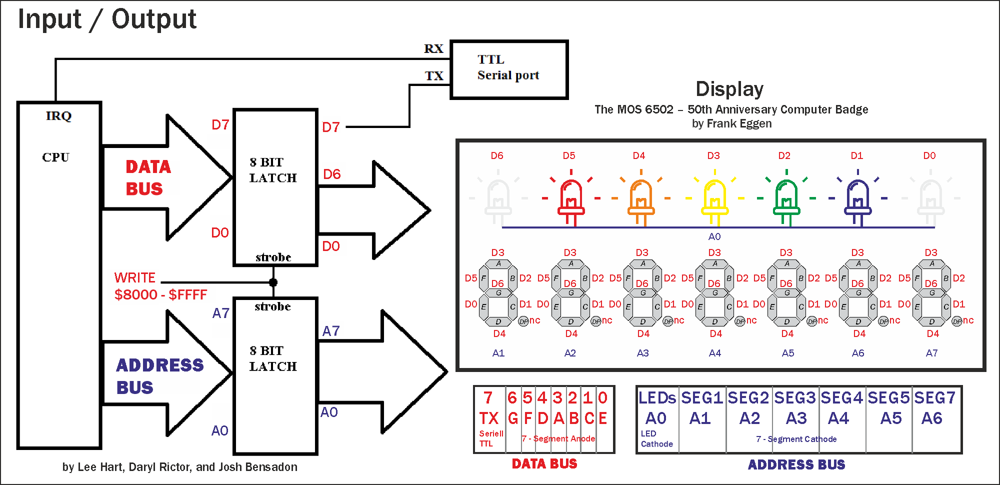
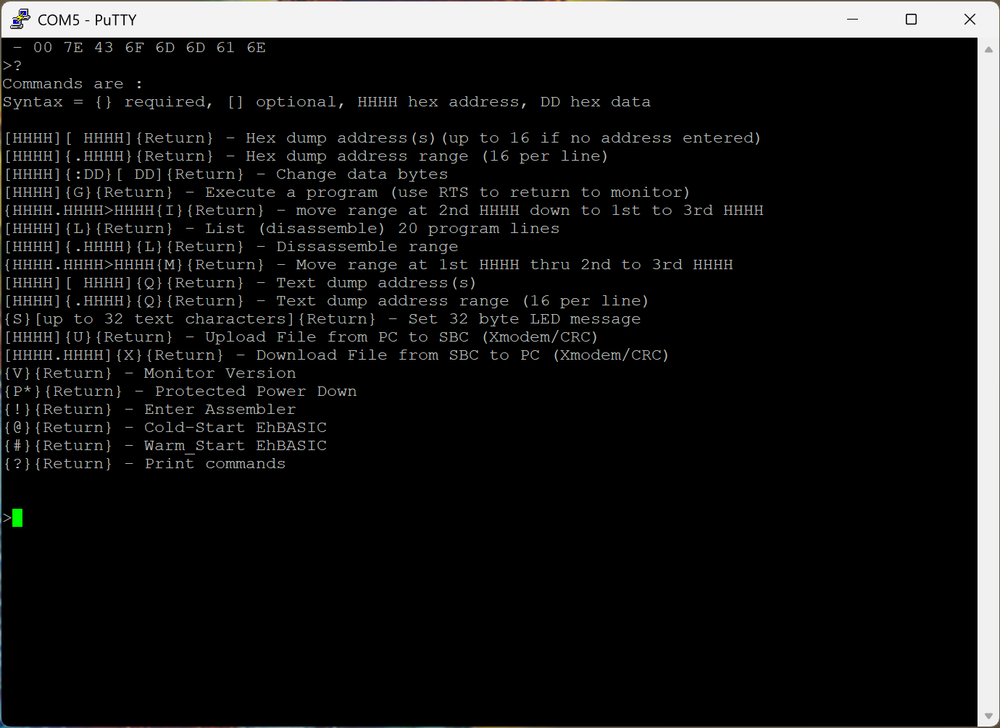

# The MOS 6502 – 50th Anniversary Computer Badge (1975–2025)

## Ein Retro‑Computer im Badge‑Format für 8‑Bit‑6502‑Fans

Von Frank Eggen • 👉 [English version](README.md)

[](https://www.youtube.com/shorts/PbgMO4NnUvw)

---

Basierend auf einer Idee von **Lee Hart, Daryl Rictor und Josh Bensadon** (neu aufgelegt und aktualisiert).  
👉 Originalprojekt: [sunrise-ev.com/6502.htm](http://www.sunrise-ev.com/6502.htm)

---

## Inhaltsverzeichnis

- [50 Jahre MOS 6502](#50-jahre-mos-6502)
- [Was ist das Computer Badge?](#was-ist-das-computer-badge)
- [Varianten](#varianten)
- [Wofür kannst du es nutzen?](#wofür-kannst-du-es-nutzen)
- [Technische Ausstattung](#technische-ausstattung)
- [Stückliste (BOM)](#stückliste-bom)
- [Montage](#montage)
- [Jumper‑Optionen](#jumper-optionen)
- [Erster Start: Lass es laufen!](#erster-start-lass-es-laufen)
- [Schaltplan](#schaltplan)
- [Speicherkarte](#speicher)
- [Eingabe/Ausgabe](#eingabe--ausgabe)
- [LED‑Anzeige](#led-anzeige)
- [Serieller Port](#serieller-port)
- [Softwarebeschreibung](#softwarebeschreibung)
- [Monitor- & Referenzhandbuch](#6502-badge--monitor--referenzhandbuch)
- [EhBASIC: Kaltstart & Warmstart](#ehbasic-kaltstart--warmstart)
- [EhBASIC-Kurzübersicht](#ehbasic-kurzübersicht--schlüsselwörter)
- [LED‑Betrieb](#led-betrieb-led-operations)
- [Serielle Ein-/Ausgabe in Assembler](#serielle-ein--ausgabe-serial-operations)
- [Systemspeicherbelegung](#systemspeicherbelegung-system-memory-usage)
- [Build‑Hinweise](#quellcode-organisation--build-hinweise)
- [Downloads](#downloadsfirmwaremanuals)
- [Bestellung](#bestellung)
- [Fehlerbehebung](#fehlerbehebung)
- [Haftungsausschluss](#haftungsausschluß)
- [Spenden](#spenden)
- [Danksagung](#danksagung)

---

## 50 Jahre MOS 6502



Der legendäre **MOS 6502** wurde 1975 vorgestellt und veränderte die Computerwelt. Er brachte Leistung zum kleinen Preis und machte den Siegeszug der **Homecomputer** möglich.

Bekannte Systeme mit 6502:

- Apple II
- Commodore VIC‑20 & C64
- Nintendo NES
- BBC Micro
- Atari VCS

👉 Mehr zur Geschichte: [team6502.org](https://www.team6502.org)

---

## Was ist das Computer Badge?



Der **MOS 6502 50th Anniversary Computer Badge** ist eine **minimalistische Neuauflage** eines 8‑Bit‑Microcomputers mit 6502‑CPU im Badge‑Format – mit heutigen Bauteilen leicht nachzubauen.

**Highlights**

- **W65C02S Mikroprozessor @ 2 MHz**
- **32 KB RAM** mit Batterie‑Backup
- **32 KB EPROM** mit Floating‑Point‑BASIC + 6502‑Monitor
- **7‑stellige 7‑Segment‑LED‑Anzeige + 7 LEDs** für Effekte
- **RS‑232‑kompatible Schnittstelle** für Datenaustausch
- **USB‑C (CH340) serielle TTL‑Schnittstelle** – direkt am PC nutzbar
- **DC/DC‑Step‑Up‑Modul** für stabilen Akkubetrieb
- **CR2032‑Batterie** für SRAM‑Datenerhalt

> Voll funktionsfähig, programmierbar in **Assembler** oder **BASIC** – und trotzdem klein genug, um als Retro‑Namensschild getragen zu werden.

---

## Varianten

**Badge‑Version**




- 7,62 × 10,16 cm (3 × 4 Zoll) – klassisches Badge‑Format
- Platinenlayout (Gerber) → [gerber/](gerber/)

---

## Wofür kannst du es nutzen?

- Als **Retro‑Namensschild** mit Laufschrift deiner Wahl
- Zum **Feiern von 50 Jahren 6502** & der Homecomputer‑Ära
- Als **Lehrprojekt** für Assembler, BASIC und Hardware‑Nostalgie
- Zum **Tüfteln & Spaßhaben** mit minimaler Teilezahl
- Als **cooles Sammlerstück** zum Jubiläum

---

## Technische Ausstattung

- W65C02S @ 2 MHz
- 32 KB RAM mit Batterie‑Backup
- 32 KB EPROM (BASIC + Monitor)
- 2× 8‑Bit‑Ausgangslatches
- 7‑stellige 7‑Segment‑LED‑Anzeige + 7 LEDs
- Serielle Soft‑RS‑232‑Schnittstelle, 9600 8N1
- USB‑C‑zu‑TTL CH340 UART‑Adapter (BTE17‑06B)
- DC/DC 5 V Step‑Up‑Boost‑Converter
- Ladefunktion für 3× AA NiCd‑Akkus

👉 Damit hast du ein **vollwertiges Retro‑System** in der Hand – minimalistisch, lehrreich und ein echter Hingucker auf jedem Nerd‑Treffen. 😎

---

## Stückliste (BOM)

_Erstellt am 2025‑09‑20 19:50_

> **Hinweis:** Für **U1** und **U2** empfiehlt sich ein DIP‑Sockel.

| Pos. | Referenz          | Menge | Wert                          | Notizen                                                                                                                                                                                                          | Beschreibung                                                   | Datenblatt                                                                                                       |
| ---- | ----------------- | ----- | ----------------------------- | ---------------------------------------------------------------------------------------------------------------------------------------------------------------------------------------------------------------- | -------------------------------------------------------------- | ---------------------------------------------------------------------------------------------------------------- |
| 1    | BT1               | 1     | Battery Holder                | 3× AA **NiCd‑Akkus** (optional). **Bei Batterien JP2 (Charging) öffnen**, sonst erhalten Batterien bei externer Versorgung Ladespannung. Bei Akkus **nur NiCd** verwenden – **Brandgefahr** bei anderen Chemien! | Holder Keystone 3×AA                                           | [Link](https://www.digikey.com/en/products/detail/keystone-electronics/106/27386)                                |
| 2    | BT2               | 1     | Battery Cell Holder CR2032    | CR2032                                                                                                                                                                                                           | Battery Holder CR2032 Horizontal Circular Holes                | [Link](https://www.digikey.com/en/products/detail/keystone-electronics/2464/303813)                              |
| 3    | C1,C4,C5,C6,C7,C8 | 6     | Kondensator 0,1 µF            |                                                                                                                                                                                                                  | Capacitor Disc D4.7 mm W2.5 mm P5.00 mm (THT)                  | [Link](https://www.digikey.com/en/products/detail/kemet/C322C104M5U5TA/818107)                                   |
| 4    | C2,C3             | 2     | Kondensator 470 µF 10–16 V    |                                                                                                                                                                                                                  | Capacitor Radial D8.0 mm P3.50 mm (THT)                        | [Link](https://www.digikey.com/en/products/detail/rubycon/16ZLH470MEFC8X11-5/3563382)                            |
| 5    | D1,D2,D3          | 3     | Diode 1N5817 (Schottky)       | **Nur D1 bestücken!** D2/D3 sind nur zu Testzwecken. **D2 und D3 mit Draht brücken.**                                                                                                                            | Diode DO‑41 SOD81 P10,16 mm horizontal (THT)                   | [Link](https://www.digikey.com/en/products/detail/smc-diode-solutions/1N5817/21705460)                           |
| 6    | J1                | 1     | 5 V DC‑DC Step‑Up‑Modul       |                                                                                                                                                                                                                  | Converter DCDC Step‑Up 5 V Module 10,5×11 (THT mit Pin‑Header) | [Link](https://de.aliexpress.com/item/1005005624977910.html)                                                     |
| 7    | J2                | 1     | CH340N SOP‑8 USB‑zu‑TTL‑Modul |                                                                                                                                                                                                                  | CH340N SOP‑8 USB‑zu‑TTL‑Modul (THT mit Pin‑Header)             | [Link](https://de.aliexpress.com/item/1005009386863437.html)                                                     |
| 8    | J3                | 1     | PIN‑Header                    | (optional)                                                                                                                                                                                                       | Pin‑Header 1×05 P2,54 mm vertikal (THT)                        | ~                                                                                                                |
| 9    | LED1,LED7         | 2     | LED Weiß                      | oder andere Farbe                                                                                                                                                                                                | LED D5,0 mm (THT)                                              | [Link](https://www.digikey.com/en/products/detail/seoul-semiconductor-inc/LW520AS/2770221)                       |
| 10   | LED2              | 1     | LED Rot                       | oder andere Farbe                                                                                                                                                                                                | LED D5,0 mm (THT)                                              | [Link](https://www.digikey.com/en/products/detail/american-bright-optoelectronics-corporation/BL-B5134/20506048) |
| 11   | LED3              | 1     | LED Orange                    | oder andere Farbe                                                                                                                                                                                                | LED D5,0 mm (THT)                                              | [Link](https://www.digikey.com/en/products/detail/rohm-semiconductor/SLR-56DUT32/2337242)                        |
| 12   | LED4              | 1     | LED Gelb                      | oder andere Farbe                                                                                                                                                                                                | LED D5,0 mm (THT)                                              | [Link](https://www.digikey.com/en/products/detail/american-bright-optoelectronics-corporation/BL-B3134/20506076) |
| 13   | LED5              | 1     | LED Grün                      | oder andere Farbe                                                                                                                                                                                                | LED D5,0 mm (THT)                                              | [Link](https://www.digikey.com/en/products/detail/american-bright-optoelectronics-corporation/BL-B2134/20505921) |
| 14   | LED6              | 1     | LED Blau                      | oder andere Farbe                                                                                                                                                                                                | LED D5,0 mm (THT)                                              | [Link](https://www.digikey.com/en/products/detail/lumimax-optoelectronic-technology/LED5BLU-D/25881229)          |
| 15   | LED8              | 1     | LED Rot (Power)               | oder andere Farbe                                                                                                                                                                                                | LED D5,0 mm (THT)                                              | [Link](https://www.digikey.com/en/products/detail/american-bright-optoelectronics-corporation/BL-B5134/20506048) |
| 16   | R1,R6             | 2     | Widerstand 10 kΩ              |                                                                                                                                                                                                                  | Axial DIN0204 L3,6 mm D1,6 mm P5,08 mm horizontal ¼ W (THT)    | [Link](https://www.digikey.com/en/products/detail/stackpole-electronics-inc/RNMF14FAD10K0/1683413)               |
| 17   | R2,R3,R4          | 3     | Widerstand 3,3 kΩ             |                                                                                                                                                                                                                  | Axial DIN0204 L3,6 mm D1,6 mm P5,08 mm horizontal ¼ W (THT)    | [Link](https://www.digikey.com/en/products/detail/stackpole-electronics-inc/RNMF14FTC3K30/2617342)               |
| 18   | R5                | 1     | Widerstand 56 Ω               |                                                                                                                                                                                                                  | Axial DIN0204 L3,6 mm D1,6 mm P5,08 mm horizontal ¼ W (THT)    | [Link](https://www.digikey.com/en/products/detail/stackpole-electronics-inc/RNMF14FTC56R0/2617362)               |
| 19   | R7                | 1     | Widerstand 2 kΩ               |                                                                                                                                                                                                                  | Axial DIN0204 L3,6 mm D1,6 mm P5,08 mm horizontal ¼ W (THT)    | [Link](https://www.digikey.com/en/products/detail/stackpole-electronics-inc/CFM14JT560R/1742246)                 |
| 20   | SEG1–SEG7         | 7     | 7‑Segment LED SC39‑11EWA      | Beste Erfahrung mit Kingbright                                                                                                                                                                                   | LED‑Display 7‑Segment (Sx39‑1xxxxx) CC (THT)                   | [Link](https://www.digikey.com/en/products/detail/kingbright/SC39-11EWA/3084564)                                 |
| 21   | SW1               | 1     | Reset‑Taster                  |                                                                                                                                                                                                                  | Taster PUSH 6 mm H4,3 mm (MJTP1230) (THT)                      | [Link](https://www.digikey.com/en/products/detail/apem-inc/MJTP1230/1798037)                                     |
| 22   | SW2               | 1     | DIP‑Schalter On/Off           |                                                                                                                                                                                                                  | DIP SPSTx01 Slide 6,7×4,1 mm W7,62 mm P2,54 mm (THT)           | [Link](https://www2.mouser.com/ProductDetail/Wurth-Elektronik/418127270901?qs=wr8lucFkNMUHAgaqq%2FoMmA%3D%3D)    |
| 23   | U1                | 1     | 27C256 EPROM                  | alternativ W27E257                                                                                                                                                                                               | DIP‑28 W15,24 mm (THT)                                         | [Link](https://www.digikey.com/en/products/detail/microchip-technology/AT27C256R-70PC/304743)                    |
| 24   | U2                | 1     | W65C02S (DIP‑40)              | Mikroprozessor                                                                                                                                                                                                   | DIP‑40 W15,24 mm (THT)                                         | [Link](https://www.westerndesigncenter.com/wdc/documentation/w65c02s.pdf)                                        |
| 25   | U3                | 1     | 74HC139 (SOP‑16)              |                                                                                                                                                                                                                  | SOP‑16 4,4×10,4 mm P1,27 mm (SMD)                              | [Link](https://www.digikey.com/en/products/detail/nexperia-usa-inc/74AHC139PW-Q100J/4020140)                     |
| 26   | U4                | 1     | CY62256N SRAM 32 KB (SOP‑28)  |                                                                                                                                                                                                                  | SOP‑28 8,4×18,16 mm P1,27 mm (SMD)                             | [Link](https://www.digikey.com/en/products/detail/rochester-electronics-llc/CY62256NLL-70ZC/12099783)            |
| 27   | U5                | 1     | MAX690xPA (DIP‑8)             | alternativ MAX692xPA                                                                                                                                                                                             | DIP‑8 W7,62 mm (THT) – MAX690 oder MAX692                      | [Link](https://www.digikey.com/en/products/detail/analog-devices-inc-maxim-integrated/MAX694CPA/948163)          |
| 28   | U6,U7             | 2     | 74HC273 (SOIC‑20)             |                                                                                                                                                                                                                  | SOIC‑20W 7,5×12,8 mm P1,27 mm (SMD)                            | [Link](https://www.digikey.com/en/products/detail/toshiba-semiconductor-and-storage/74HC273D/6198939)            |
| 29   | X1                | 1     | Oszillator 2 MHz (DIP‑14)     |                                                                                                                                                                                                                  | Quarzoszillator DIP‑14 (THT)                                   | [Link](https://www.digikey.com/en/products/detail/cts-frequency-controls/MXO45-3C-2M000000/1801885)              |

---

## Montage

Prüfe zunächst die Stückliste und ob du alle Teile hast. Zur Montage benötigst du **Lötkolben**, **Lötzinn** und **Flussmittel** (für die SMD‑ICs). Eine **Seitzange**, **Entlötpumpe** und **Entlötlitze** sind hilfreich.

Empfohlene Reihenfolge:

1. **SMD‑ICs löten:** U3 (74HC139), U6/U7 (74HC273), danach U4 (SRAM).  
   Tipp: Etwas Flussmittel auf den **ersten Pin oben links** und den **letzten Pin unten rechts**, IC ausrichten, diese beiden Pins mit wenig Lötzinn fixieren. Sitzt alles sauber, die restlichen Pins nacheinander verlöten. **Achte auf die korrekte Polung/Pin 1‑Markierung.**

2. **Sockel bestücken:** U1 (EPROM) und U2 (W65C02S).

3. **U5 (MAX690 bzw. MAX692)** einlöten.

4. **X1 (2 MHz‑Oszillator)** einsetzen.

5. **Dioden:** **Nur D1 (1N5817) bestücken!** D2/D3 sind Testpunkte – **mit Draht brücken.**

6. **Widerstände R1–R7** bestücken.

7. **Keramikkondensatoren C1, C4–C8** einlöten.

8. **Elkos C2/C3 (470 µF, 10–16 V)** einlöten.

9. **Taster SW1 und DIP‑Schalter SW2 (ON/OFF)** einsetzen.

10. **LEDs:** LED1–LED7 (LED‑Leiste) sowie **LED8 (Power‑LED)** einbauen. **Polung beachten!** Das Loch mit dem **eckigen** Lötpad ist die **Kathode**.

11. **J1 (DC/DC‑Step‑Up 5 V, 10,5×11):** mit **3‑poligen Pin‑Headern** auf der **Rückseite** montieren. **Polung beachten.** Die Spule des Moduls zeigt **von der Platine weg**.  
    **Kein Step‑Up nutzen?** Dann **Pin 1 und 3** von J1 brücken (**nicht** mit Pin 2 verbinden). Das empfiehlt sich nur bei stabilen 5 V (Labornetzteil/USB‑C‑Powerbank).

12. **J2 (CH340N USB‑zu‑TTL‑Modul)** auf der Rückseite mit **5‑poligem Pin‑Header** verbinden (Polung beachten).

13. **Reinigen:** Flussmittelreste entfernen (Isopropanol).

14. **7‑Segment‑Displays:** nun SEG1–SEG7 einsetzen. **Polung beachten.** Unten rechts befindet sich ein **Punkt** – auf der **Vorderseite nach unten** ausrichten.

15. **Batteriehalter BT1/BT2** bei Bedarf montieren, **aber noch keine** Batterien/Akkus einsetzen.  
    
    > **Achtung:** *Nur 3× AA NiCd‑Akkus (1,2 V) laden!* Die Ladeelektronik ist **sehr einfach**. **Keine** Li‑Ion oder NiMH verwenden → **Brand-/Explosionsgefahr**. Bei **Batterien** die Ladefunktion **deaktivieren** (**JP2 öffnen**).

16. **Zum Schluss** U2 (W65C02S‑CPU) und das programmierte U1 (EPROM) in die Sockel stecken.

Damit ist dein **MOS 6502 50th Anniversary Computer Badge** fertig. 🎉

---

## Jumper‑Optionen

Der **Badge** hat **drei Jumper** für unterschiedliche Konfigurationsoptionen.

1. **JP1 – Prozessortyp**  
   Offen = Standard für den **W65C02S** (Western Design Center). Bei älteren Typen (MOS, Rockwell, UMC, Synertek) muss **GND** verbunden werden → **JP1 schließen**. Verwende **2 MHz‑Varianten** (z. B. MOS 6502**AD**, Rockwell R6502**AP**, UMC UM6502**A**). Getestet ist die Schaltung nur mit **W65C02S**. CMOS‑Varianten (**65C02**) haben einen deutlich geringeren Stromverbrauch. Das **BadgeOS** nutzt erweiterte **CMOS‑Opcodes** – die ursprüngliche **NMOS‑Variante** benötigt ein eigenes OS.

2. **JP2 – Laden der AA‑NiCd‑Akkus**  
   Standardmäßig **geschlossen**. Wenn du **3× AA 1,5 V Batterien** statt NiCd‑Akkus verwendest, **muss JP2 geöffnet werden**, damit keine Ladespannung anliegt (bei externer Versorgung über USB‑C J2 oder Pin‑Header J3).

---

## Erster Start: Lass es laufen!

1. **SW2 auf OFF.**  
2. **5 V** an **J2 (USB‑C/CH340)** oder **J3 (Pin‑Header)** anschließen (**Polung beachten!**).  
3. **SW2 auf ON.** Die Power‑LED leuchtet. Du solltest die Laufschrift „6502 badge for VCF“ bzw. „6502 50th Birthday 1975‑2025“ auf der 7‑Segment‑Anzeige sehen.

**Akkubetrieb testen:**  
SW2 **OFF**, externe 5 V trennen. **CR2032** (für SRAM‑Backup) und **3× AA NiCd** einsetzen. Im reinen Batteriebetrieb leuchtet die Power‑LED **nicht**, solange SW2 **OFF** ist. **SW2 ON** → der Computer startet, die Laufschrift erscheint. Ladezeit der NiCd‑Akkus über USB‑C: ca. **6–8 h**. Laufzeit: **6–12 h** (abhängig von LED‑Vorwiderständen/Helligkeit).

Die Leiterplatte hat vier **Befestigungslöcher** (z. B. für Abstandshalter oder Gehäuse).



Kurzes Video: [Zu YouTube](https://www.youtube.com/shorts/PbgMO4NnUvw)

Ein zusätzliches Highlight ist das **Lanyard**, das an den oberen Löchern befestigt werden kann – so kannst du das **Badge** bequem umhängen.

---

## Schaltplan

Schaltplan des **MOS 6502 – 50th Anniversary Computer Badge (1975–2025)** → [downloads/Schematic.pdf](downloads/Schematic.pdf) (PDF, ~0,2 MB)



Der **Badge‑Computer** ist ein vollständiger minimalistischer Rechner: **6502‑CPU mit 2 MHz**, **32 KB RAM (U4)** und **32 KB ROM (U1)**. **U3** bildet die Adresslogik (Chip‑Select RAM/ROM) und die Ansteuerung der LED‑Segmente. Die zwei **74HC273 (U6/U7)** treiben als Latches/Flip‑Flops die LEDs und die 7‑Segment‑Anzeige. **Bit 7** dient als **TX** für die serielle Schnittstelle.

**RX** wird über **IRQ (Pin 4)** der CPU eingelesen. Es handelt sich um eine **softwarebasierte RS‑232‑Schnittstelle** (Soft‑UART); das **OS im ROM** übernimmt das Timing/Handling (9600 Baud, 8N1). Das CH340‑Modul an **J2** stellt die USB‑Anbindung her (unter Windows ggf. Treiber installieren). Mit **PuTTY/Minicom** kannst du über **9600,8N1** kommunizieren.

---

## Speicher

Das Badge hat **32 KB RAM** ab Adresse **\$0000–\$7FFF** und **32 KB ROM** **\$8000–\$FFFF**.

| Start | Ende  | Bereich              |
| ----- | ----- | -------------------- |
| 8000h | FFFFh | ROM 32 KB (EPROM U1) |
| 0000h | 7FFFh | RAM 32 KB (SRAM U4)  |

---

## Eingabe / Ausgabe

Die beiden **74HC273 8‑Bit‑Latches** (**U6/U7**) steuern die Ein-/Ausgabe. Ein gemeinsamer Takt wird aus einem **Schreibimpuls (R/W)** in den ROM‑Adressraum abgeleitet. Alle **8 Datenbus‑** und die **niedrigen 8 Adressbusleitungen** werden gelatcht, sobald in den Bereich **\$8000–\$FFFF** geschrieben wird. Diese Latches treiben die **8 Reihen** und **7 Spalten** der **multiplexed** LEDs und 7‑Segmentanzeigen. Aus Layout‑Gründen sind Daten-/Adresspins zwischen den Latches gemischt; logisch ist jede Leitung korrekt zugeordnet (**D0→D0**, **A4→A4**, …).



Dieser „ungewöhnliche“ Aufbau erfüllt widersprüchliche Ziele:

- Mit **einer** Anweisung lassen sich alle **15 LED‑Ausgangsbits** gleichzeitig aktualisieren (flackerfreie Anzeige).
- **Minimale Hardware** (kein separater UART).
- **Einfaches/kleines PCB‑Layout**.

**Bit 7** des Daten‑Latches wird für die LEDs nicht benötigt und dient daher als **TX**. **IRQ** der CPU ist der **RX**‑Eingang. Zusammen mit Software ergibt das einen **minimalistischen interrupt‑gesteuerten** seriellen Port (Monitor + BASIC laufen darüber).

---

## LED‑Anzeige

Die **Datenbus‑Latches** treiben die **LED‑Anoden (Segmente)**, die **Adressbus‑Latches** die **LED‑Kathoden (Ziffern)**.  
**Datenbits 0–6** wählen die Segmente **A–G**; **Datenbit 7** ist **TxD**.  
**Adressbits 1–7** wählen die **7 Ziffern**; **Adressbit 0** wählt die **7 diskreten LEDs**.

Anoden sind **aktiv high**, Kathoden **aktiv low**. Beispiel: Segment **A** der **linkesten Ziffer** einschalten → **Datenbit 3 = 1**, **Adressbit 1 = 0** → an Adresse **\$80FD** den Wert **\$08** schreiben. (Jede Adresse **≥ \$8000** wirkt gleich.)

> **Hinweis zur Firmware:** Im Vergleich zum Original von Lee Hart/Daryl Rictor/Josh Bensadon nutzt diese Version **7 statt 5 LEDs** am Datenbus. Die Original‑Firmware steuert nur 5 LEDs. Verwende daher die angepasste Firmware **BadgeOS_50th.zip** (siehe **Downloads**), die alle **7 LEDs** nutzt. Im Ordner **basic/** findest du Beispiele für LED‑Lauflichter.

---

## Serieller Port

Der serielle Port ist ein **TTL‑asynchroner** Datentransfer (TxD/RxD/GND). Er ist **RS‑232‑ähnlich**, verwendet aber **5 V/0 V**‑Pegel und **nicht invertierte** Daten (Leerlauf = 5 V = 1). Du kannst entweder

- einen **TTL‑zu‑RS‑232‑Adapter** an **J3** verwenden oder
- ein **CH340N USB‑zu‑TTL‑Modul** an **J2** aufstecken (empfohlen).

Die Konfiguration ist **9600, N, 8, 1**.  
Für **Copy & Paste** von Quelltexten empfiehlt sich, in deinem Terminal **Sendepausen** zu setzen:

1. Verzögerung **pro Byte**: ~**20 ms**  
2. Verzögerung **nach LF/CR**: ~**200 ms**

Da es **keinen FIFO‑Puffer** gibt, führen zu schnelle Übertragungen zu **Timing‑Fehlern**.

---

## Softwarebeschreibung

Nach dem **Reset** liest der 6502 den **Reset‑Vektor** aus **\$FFFC/\$FFFD**. Die Routine initialisiert Anzeige und seriellen Port und wechselt in den **Monitor**. Standardmäßig läuft die Laufschrift „6502 badge for VCF“ / „6502 50th Birthday 1975‑2025“. Die 7 diskreten LEDs zeigen ein **Knight‑Rider‑Muster**. Während auf serielle Eingaben gewartet wird, wird die Anzeige kontinuierlich aktualisiert.

---

## 6502 Badge – Monitor‑ & Referenzhandbuch

Die Eingabe von `?` + **Return** zeigt die Hilfe.



### Monitorbefehle

Grundformat einer Befehlszeile:

```
SSSS.EEEE C <Return>
```

- `SSSS`/`EEEE` = Start‑/Endadresse (durch Punkt getrennt)  
- `C` = **Befehlssymbol** (nicht alphanumerisch)  
- `<Return>` = Eingabetaste  
- **Keine Leerzeichen** zwischen den Elementen (z. B. `1234.5678L<Return>`)  

Adressen können 2–4 Hex‑Ziffern haben. Werden mehr eingegeben, zählen die **letzten 4**. Kürzere Eingaben werden links mit `0` aufgefüllt. Viele Befehle merken sich die **zuletzt verwendete** Adresse und **inkrementieren** automatisch.

`?<Return>` zeigt eine Kurz‑Hilfe:

```
Commands are :
Syntax = {} required, [] optional, HHHH hex address, DD hex data

[HHHH][ HHHH]{Return}         - Hex dump address(s) (bis zu 16 ohne Adresse)
[HHHH]{.HHHH}{Return}         - Hex dump Bereich (16 pro Zeile)
[HHHH]{:DD}[ DD]{Return}      - Datenbytes ändern
[HHHH]{G}{Return}             - Programm ausführen (RTS kehrt zum Monitor zurück)
{HHHH.HHHH>HHHHI}{Return}     - Bereich (2.) nach unten in 1.→3. einfügen
[HHHH]{L}{Return}             - 20 Zeilen disassemblieren
[HHHH]{.HHHH}{L}{Return}      - Bereich disassemblieren
{HHHH.HHHH>HHHHM}{Return}     - Bereich (1.→2.) nach 3. verschieben
{HHHH}[ HHHH]{Q}{Return}      - Textdump Adresse(n)
[HHHH]{.HHHH}{Q}{Return}      - Textdump Bereich (16/Zeile)
{S}[bis zu 32 Textzeichen]{Return} - LED-Nachricht setzen
[HHHH]{U}{Return}             - Upload (PC→SBC, XMODEM/CRC)
[HHHH.HHHH]{X}{Return}        - Download (SBC→PC, XMODEM/CRC)
{V}{Return}                   - Monitorversion
{P*}{Return}                  - Geschütztes Herunterfahren
{!}{Return}                   - Mini-Assembler
{@}{Return}                   - EhBASIC Kaltstart
{#}{Return}                   - EhBASIC Warmstart
{?}{Return}                   - Hilfe anzeigen
```

Die folgenden Abschnitte erklären die wichtigsten Befehle: **Hex‑Dump**, **Edit Memory**, **Move/Insert**, **Execute**, **Disassembler**, **Text‑Dump**, **XMODEM**, **Version**, **Power‑Down**, **Mini‑Assembler**. (Details wie im Original, gekürzt und sprachlich bereinigt.)

---

## EhBASIC: Kaltstart & Warmstart

**Kaltstart `{@}<Return>`** initialisiert RAM und setzt die Obergrenze („top of memory“). Eingabe in **Dezimal**:

- `2048` → 2 KB RAM
- `32768` → 32 KB RAM

Beispiel (2 KB RAM):

```
> @
Memory size ? 2048
1023 Bytes free
Enhanced BASIC 2.22

Ready
```

Die ersten 1 KB RAM nutzt Monitor & Anzeige; daher bleiben bei 2 KB insgesamt ≈ 1 KB frei. Mit `SYS<Return>` kehrst du vom EhBASIC‑Prompt in den Monitor zurück.  
**Warmstart `#<Return>`** kehrt anschließend ohne Neuinitialisierung zu EhBASIC zurück (Programm im RAM bleibt erhalten).

---

## EhBASIC‑Kurzübersicht & Schlüsselwörter

EhBASIC von **Lee Davison** (hier mit freundlicher Genehmigung angepasst). Handbuch: `http://www.sunrise-ev.com/photos/6502/EhBASIC-manual.pdf`.

**Stichwörter (Auszug):**  
`ABS AND ASC ATN BIN$ BITCLR BITSET BITTST CALL CHR$ CLEAR CONT COS DATA DEC DEEK DEF DIM DO DOKE ELSE END EOR EXP FN FOR FRE GET GOSUB GOTO HEX$ IF INC INPUT INT IRQ LCASE$ LEFT$ LEN LET LIST LOAD LOG LOOP MAX MID$ MIN NEW NEXT NMI NOT NULL OFF ON OR PEEK PI POKE POS PRINT READ REM RESTORE RETIRQ RETNMI RETURN RIGHT$ RND RUN SADD SAVE SGN SIN SPC( SQR STEP STOP STR$ SWAP SYS TAB( TAN THEN TO TWOPI UCASE$ UNTIL USR VAL VARPTR WAIT WHILE WIDTH + - * / ^ << >> > = <`

- Schlüsselwörter **GROSS** und **ohne Leerzeichen**.  
- Zahlen: Integer/Dezimal/Float; Präfix `$` (Hex) oder `%` (Binär), z. B. `$0A`, `96.3`, `2.718E-3`.  
- Variablen: numerisch, `Strings$`, Arrays `(n)`; Strings in `"`…`"`.  

---

## LED‑Betrieb (LED Operations)

Der Monitor enthält Routinen für **Refresh der 7‑Segment‑Anzeige** und der **diskreten LEDs** (Multiplex‑Scan + Scroll). Basisvariablen u. a.:

```
Lbuff  = $02A0 ; LED-Textpuffer (max. 32 Bytes)
LDbuff = $02C0 ; Puffer diskrete LEDs (max. 32 Bits)
Lptr   = $E2   ; LED-Zeiger (0..31)
Ldig   = $E3   ; Digit-Zähler (0..7; 0 = diskrete LEDs)
Lscn   = $E4   ; Scan-Delay (Helligkeit)
Lscl   = $E5   ; Scroll-Delay
Lscnc  = $E6   ; Scan-Zähler
Lsclc  = $E7   ; Scroll-Zähler
LEDchk1 = $E8  ; Konfig-Checksumme 1
LEDchk2 = $E9  ; Konfig-Checksumme 2
```

`LEDchk1=$A5` **und** `LEDchk2=$5A` verhindern das Überschreiben der Puffer beim Reset (sonst Standardtext „6502 badge for VCF“).

---

## Serielle Ein-/Ausgabe (Serial Operations)

**Monitor‑Subroutinen** (je nach ROM‑Datum; prüfe `V`‑Befehl):

- **Serial_Output** (`$EAE8` *oder* `$EAEC`) – sendet 1 Byte (A)
- **Serial_Input**  (`$EB35` *oder* `$EB39`) – blockierendes Lesen (A)
- **Scan_Input**    (`$EB4C` *oder* `$EB50`) – nicht blockierend (Carry=0, wenn nichts da)

---

## Systemspeicherbelegung (System Memory Usage)

### Zero Page

| Bereich   | Nutzung           |
| ---------:| ----------------- |
| `$00–$13` | EhBASIC           |
| `$14–$31` | frei              |
| `$32–$3F` | Monitor‑Variablen |
| `$40–$5A` | frei              |
| `$5B–$DF` | EhBASIC           |
| `$E2–$E9` | LED‑Treiber       |
| `$EA–$ED` | Serieller Treiber |
| `$EF–$FF` | EhBASIC           |

### RAM

| Bereich       | Nutzung                               |
| -------------:| ------------------------------------- |
| `$0100–$01FF` | System‑Stack                          |
| `$0200–$027F` | Serieller Receive‑Ringpuffer          |
| `$02A0–$02DF` | LED‑Puffer                            |
| `$0300–$037F` | Monitor‑Eingabepuffer                 |
| `$0390–$03FF` | EhBASIC‑Eingabepuffer                 |
| `$0400–$7FFF` | Nutzer‑RAM / EhBASIC‑Programm (32 KB) |

### ROM (abhängig vom Monitor‑Datum)

| **5‑17‑17 ROM** | **2‑24‑18 ROM** | Beschreibung          |
| --------------- | --------------- | --------------------- |
| `$C000–$C1FF`   | `$C000–$C1FF`   | CRC‑Tabelle (XMODEM)  |
| `$C200–$EA9B`   | `$C200–$EA9F`   | EhBASIC               |
| `$EA9C–$EB64`   | `$EAA0–$EB68`   | Serielle I/O‑Routinen |
| `$EB65–$FC39`   | `$EB69–$FC3D`   | Monitor               |
| `$FC3A–$FD93`   | `$FC3E–$FD97`   | LED‑Unterstützung     |
| `$FD94–$FFBE`   | `$FD98–$FFC2`   | XMODEM                |
| `$FFBF–$FFFF`   | `$FFC3–$FFFF`   | Reset & Vektoren      |

---

## Quellcode‑Organisation & Build‑Hinweise

Mit Ausnahme von EhBASIC stammt die Software von **Daryl Rictor**. Nutzung und Anpassung für **nicht‑kommerzielle** Zwecke erlaubt.

**Dateien**

- `sbc.asm` – „Makefile“: lädt alle Quellen in richtiger Reihenfolge/Adresse.
- `basic.asm` – EhBASIC‑Quelle.
- `basldsv.asm` – Patch für Load/Save via XMODEM.
- `sbcOS.asm` – Monitor inkl. Disassembler & Mini‑Assembler.
- `serial.asm` – Software‑Serielltreiber.
- `LEDdrive.asm` – LED‑Treiber (Refresh, Scroll, Textfunktionen).
- `font.asm` – LED‑Font (ASCII‑Mapping auf Latch‑Pins).
- `xmodem.asm` – XMODEM‑Protokoll.
- `CRCtable.asm` – CRC‑Lookuptabelle.
- `reset.asm` – Reset/Initialisierung; ROM‑Vektoren `$FFFA–$FFFF`; BRK‑Handler (`$00`) → Reset & Monitor.

**Assemblieren (6502 Macroassembler & Simulator, `6502.exe`)**

1. Programm starten  
2. `sbc.asm` öffnen (`File → Open → sbc.asm`)  
3. Optionen setzen:
   - `Assembler` → **Extra byte after BRK**: **deaktivieren**
   - `General` → **65C02, 6501** auswählen
4. **F7** (Assemble)  
5. Objekt speichern (`File → Save Code`): Intel‑Hex, S‑Record oder Binär  
   - **Startadresse**: `0xC000` (16 KB ROM) **oder** `0x8000` (32 KB ROM)  
   - **Endadresse**: `0xFFFF`

---

## Downloads/Firmware/Manuals

1. Angepasste Firmware (32 KB, 27C256, **7× LEDs**) → [downloads/BadgeOS_32k_50th.rom](downloads/BadgeOS_32k_50th.rom) (BIN, 32 KB)
2. Badge-Manual (50th Version deutsch) > [hier](https://github.com/FraEgg/The-MOS-6502-50th-Anniversary-Computer-Badge/downloads/Maunal_50th_DE_2.2.pdf) < als PDF 2.6MB
3. Original **BadgeOS (Firmware/ROM)** → [downloads/BadgeOS.zip](downloads/BadgeOS.zip) (ZIP, ~0,8 MB)
4. **Badge Manual** (Lee Hart, Daryl Rictor, Josh Bensadon) → [downloads/badge-manual.pdf](downloads/badge-manual.pdf) (PDF, ~1,6 MB)
5. **EhBASIC Manual** → [downloads/EhBASIC-manual.pdf](downloads/EhBASIC-manual.pdf) (PDF, ~0,5 MB)
6. **Schaltplan** → [downloads/Schematic.pdf](downloads/Schematic.pdf) (PDF, ~0,2 MB)
7. **Platinenlayout (Gerber)** → [gerber/](gerber/)
8. **BOM‑Dateien** → [bom/](bom/)  
9. Treiber für **CH340 USB‑C ↔ TTL** → <https://www.arduined.eu/tag/ch340/>
10. Weitere Downloads → [downloads/](downloads/)

---

## Bestellung

Das Projekt ist als „Shared Project“ bei **PCBWay** verfügbar:  
[The MOS 6502 – 50th Anniversary Computer Badge (1975–2025) – PCBWay Share Project](https://www.pcbway.com/project/shareproject/The_MOS_6502_50th_Anniversary_Computer_Badge_1975_2025_439a8755.html)

---

## Fehlerbehebung

1. **Power‑LED leuchtet, aber Anzeige flackert.**  
   Prüfe **U2 Pin 8**: liegen **4,5–5 V** stabil an? Falls nicht, Stromquelle prüfen. Bekommt der 5 V‑Step‑Up **< 1,2 V** Eingangsspannung, bricht er ein und pulsiert.

2. **Einige LEDs sind dunkel oder dauerhaft an (auch 7‑Segment).**  
   Prüfe **U6/U7 (74HC273)** auf Lötbrücken/kalte Lötstellen.

3. **Power‑LED leuchtet, sonst keine Funktion.**  
   
   1) **U3 (74HC139)** prüfen (Kurzschlüsse/Kontakt).  
   2) **U1 (EPROM)** und **U2 (CPU)** korrekt eingesetzt/Programm vorhanden?  
   3) **U4 (SRAM)** korrekt und mit Kontakt?  
   4) **X1 (Oszillator)** richtig bestückt?

4. **Keine USB‑Verbindung (Windows).**  
   **CH340‑Treiber** installieren (siehe **Downloads**).

5. **CH340‑LED leuchtet im Akkubetrieb auch bei OFF.**  
   Normal: Das CH340‑Modul wird aus dem Akku gespeist. Dadurch bleibt **IRQ** auf **High**, auch ohne USB‑Kabel. Sonst landet die CPU in einer IRQ‑Schleife und startet nicht.

---

## Haftungsausschluß

Dies ist ein **nicht‑kommerzielles Hobbyprojekt**. Nachbau und Nutzung des **MOS 6502 – 50th Anniversary Computer Badge (1975–2025)** erfolgen **auf eigenes Risiko**. Es gibt **keine Garantie** auf Funktion, Sicherheit, Vollständigkeit oder Fehlerfreiheit. Der Ersteller (Frank Eggen) haftet **nicht** für Schäden oder Folgeschäden aus Nachbau oder Verwendung.

---

## Spenden

Ich habe viele Stunden in dieses Projekt investiert. Wenn du meine Arbeit unterstützen möchtest, freue ich mich über einen Beitrag zur Kaffeekasse. **Vielen Dank!**  
**PayPal:** [Danke sagen!](https://www.paypal.com/donate/?cmd=_s-xclick&hosted_button_id=Q8HXKYARXKT4L&ssrt=1714757590172)

---

## Danksagung

1. Dieses Projekt basiert auf der Idee von **Lee Hart, Daryl Rictor und Josh Bensadon** → Original: [sunrise-ev.com/6502.htm](http://www.sunrise-ev.com/6502.htm). Vielen Dank für die Pionierarbeit – und besonders an **Lee Hart** für hilfreiche Tipps während der Überarbeitung. 🙏  
2. **Chuck Peddle** und Team bei **MOS** (u. a. Terry Holdt, Wil Mathys, Rod Orgill, Harry Bawcom, Sydney Anne Holt, Walt Eisenhower, John Paivinen) für den 6502 → [team6502.org](https://www.team6502.org).  
3. **Bill Mensch** (WDC) für Dokumentation und Weiterentwicklung des 6502 → [westerndesigncenter.com](https://www.westerndesigncenter.com).  
4. **Ben Eater** für „Build a 6502 computer“ → [eater.net/6502](https://eater.net/6502).
   
   


